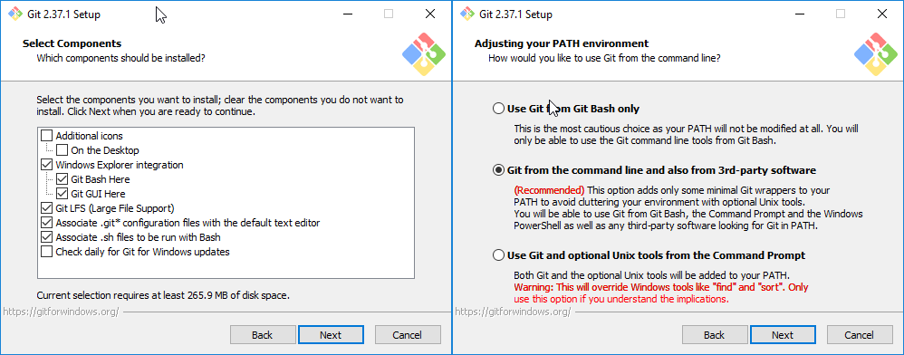
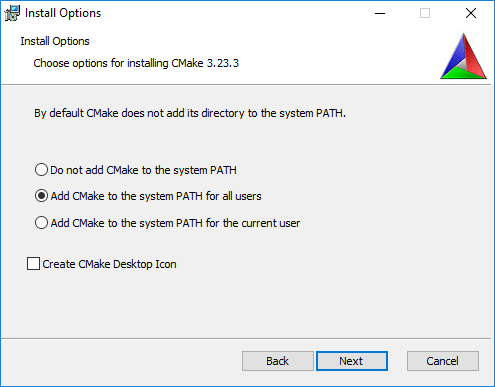
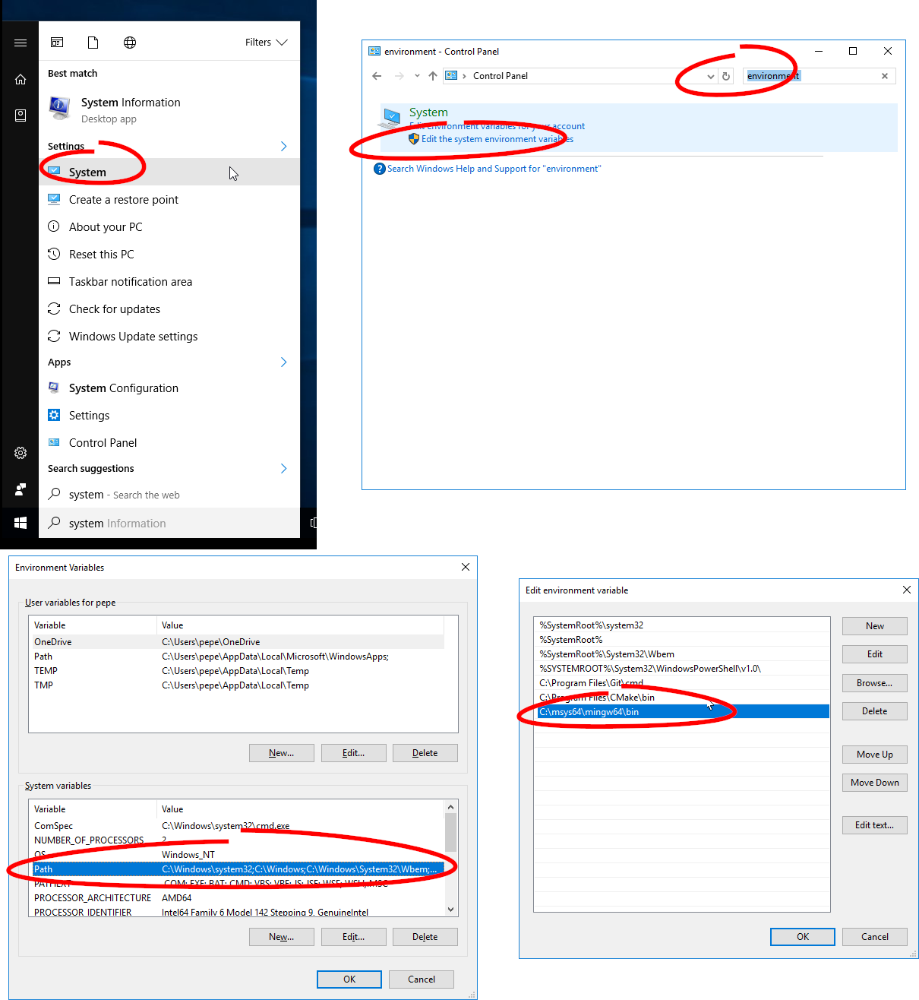
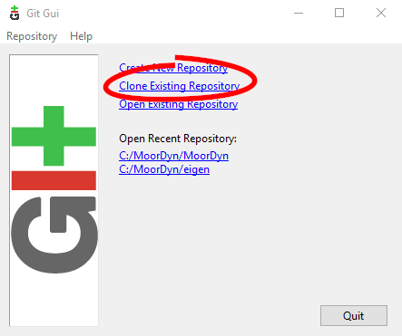
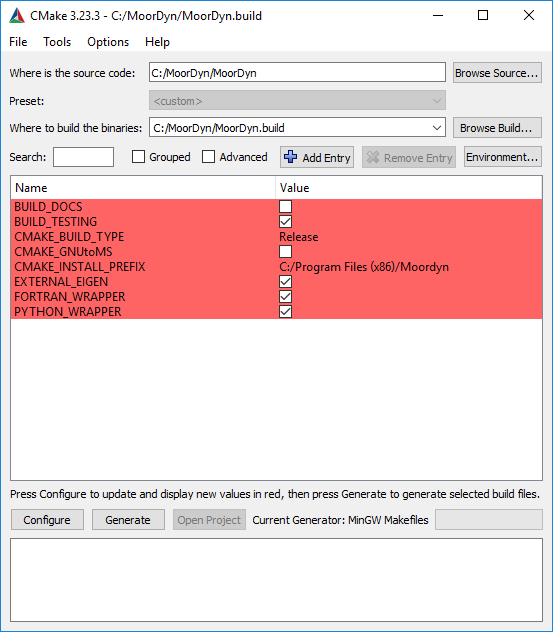
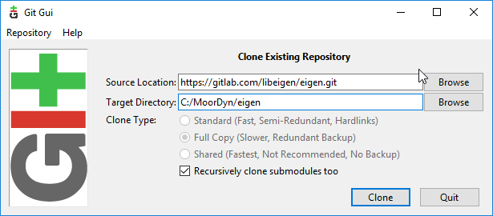
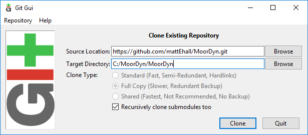
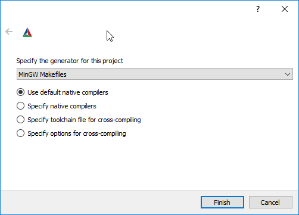
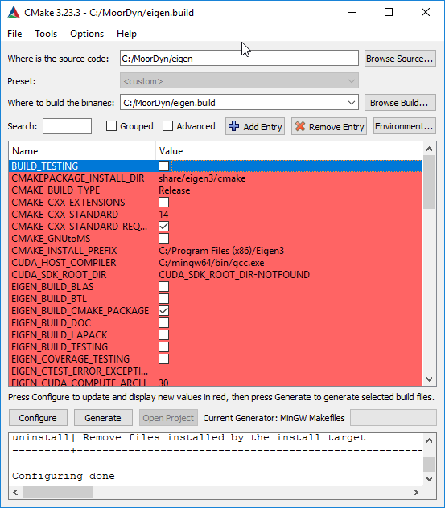
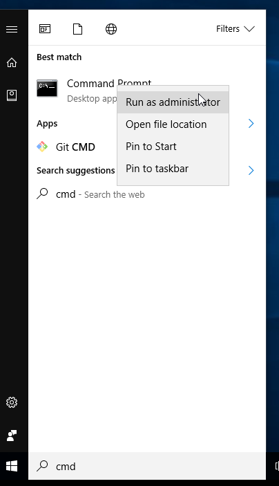

.. _compiling:

Compiling
=========

MoorDyn is available in two forms, C and F, with two different versions, v1 and v2. V1 is
the original MoorDyn code, containing just point and line objects. V2 is the upgraded
version of MoorDyn v1. You can read more on the :ref:`home page <index>`. It includes the
capability to simulate rigid bodies, nonlinear tension, wave kinematics, bending 
stiffness, and more. Further details can be found in the :ref:`theory section <theory>`
and :ref:`structure section <structure>`. 

This page describes compiling options for MoorDyn-C. For MoorDyn-F (whether as part of 
OpenFAST/Fast.Farm or with its own driver), please refer to the 
`OpenFAST documentation <https://openfast.readthedocs.io/en/main/source/install/index.html>`_. 
MoorDyn-F in a standalone form can be compiled as moordyn_driver inside of the build folder.

MoorDyn-C is available on `GitHub <https://github.com/FloatingArrayDesign/moordyn/>`_. The 
latest release can be found in the master branch. MoorDyn-C v1 is currently in the master branch
of this repo, and it can be compiled using these :ref:`instructions <compile_simple>`. 

The following sections describe how to install MoorDyn-C 
:ref:`using the pre-compiled libraries <releases>`,
:ref:`using the python wrapper <compile_python>`, how to 
:ref:`compile all features <CMake_compile>`, and how to 
:ref:`compile a simple library <compile_simple>` (version 1 method). These compile instructions
are broken down by operating system. 

Pre-Compiled Releases
---------------------
.. _releases:

Typically if you are just looking for the compiled libraries,
either because it is a dependency of some other software,
or because you are integrating it on your C/C++ project,
this is the easiest way to obtain them.

Depending on your OS, you have several options to download and install
precompiled packages.
No matter the way you install it, the precompiled package will provide you with
the same libraries, headers and CMake project files as compiling with
:ref:`cmake <CMake_compile>`.

Windows
^^^^^^^

An installer for each released version can be found at the
`releases page <https://github.com/FloatingArrayDesign/MoorDyn/releases>`_.
Just select/expand the latest release, download the file named
"Moordyn-X.Y.Z-win64.exe" (with X.Y.Z the specific version you chosen) and
execute it.

MacOS
^^^^^

Similarly to Windows, just head your browser to the
`releases page <https://github.com/FloatingArrayDesign/MoorDyn/releases>`_,
select/expand the latest release, download the file named
"Moordyn-X.Y.Z-Darwin.sh" (with X.Y.Z the specific version you chosen) and
execute it.

NOTE: The self-extracting file you have downloaded cannot be executed until you
give it execution permissions.
This can be done by executing the following command:

.. code-block:: bash
   
   chmod u=rwx <executable name>

Linux
^^^^^

Some GNU/Linux distributions already have packages deployed for their package
managers, which would make your life way easier.
Otherwise, a self-extracting package is also provided.

Arch
""""

There is an AUR package that you can easily install on your system, just typing

.. code-block:: bash
   
   yay -S moordyn

This is also valid for Arch derivatives, like Manjaro or Endeavour OS.

Others
""""""

On other Linux distributions you can give a shot to the self-extracting
package.
However, it is strongly recommended to compile it yourself with
:ref:`cmake <CMake_compile>`.

To use the self-extracting package head your browser to the
`releases page <https://github.com/FloatingArrayDesign/MoorDyn/releases>`_,
select/expand the latest release, download the file named
"Moordyn-X.Y.Z-Linux.sh" (with X.Y.Z being the specific version you choose) and
execute it.

NOTE: The self-extracting file you have downloaded cannot be executed until you
give it execution permissions.
This can be done by executing the following command:

.. code-block:: bash
   
   chmod u=rwx <executable name>

Compile as a Simple Library
---------------------------
.. _compile_simple:

MoorDyn-C v2/v1 can be compiled as a simple library that can be run in the driver file.
The installation location is dependent on your operating system. This is the easiest way
to compile MoorDyn from the source code. This method does not compile any of the wrappers
that allow MoorDyn to be packaged into other codes. For an example in python of driving
MoorDyn compiled via this simple method see the :ref:`Python C API section <compile_python>`.

Before you begin, make sure the following tools are installed, along with a C++
compiler. On MacOS, the built in compiler is clang. 

* `Git <https://git-scm.com/>`_
* `CMake <https://CMake.org/>`_

Ensure you have the MoorDyn V2 source code. This can be obtained by cloning with git or 
downloading from the GitHub repository. Next, navigate to the compile directory in 
terminal that corresponds to your operating system:

* `MoorDyn/compile/SO` for Linux
* `MoorDyn/compile/DYLIB` for MacOS
* `MoorDyn/compile/DLL` for Windows 

Once inside one of the three directories above, run the `make` command. MoorDyn 
will compile into a collection of object files (.o) and the library file (.so, .dylib, 
.dll). This library file is what the driver function will call. 

The above steps can also be used to compile MoorDyn v1. Run the make command from the 
corresponding directory to compile the library:

* `MoorDyn/compileSO` for Linux
* `MoorDyn/compileDYLIB` for MacOS
* `MoorDyn/compileDLL` for Windows 

Compile using CMake
-------------------

.. _CMake_compile:

The CMake installation of MoorDyn v2 installs all the libraries of MoorDyn as well and 
builds all the wrappers. It is the most useful installation method but can run into 
issues when compiling. Instructions for a simpler compile method that skips all the 
additional features and just makes a MoorDyn library are available in the :ref:`simple 
library section <compile_simple>`. The CMake installation process is slightly different
depending on your operating system. Please see the corresponding section below:

Windows
^^^^^^^

This section will show how to install Eigen3 and MoorDyn in the default folders
(``C:\Program Files (x86)\Eigen3`` and ``C:\Program Files (x86)\Moordyn``) using CMake
This documentation assumes that you are building in an MSYS2 build environment.

Install the following necessary tools:

* `Git <https://git-scm.com/>`_
* `CMake <https://CMake.org/>`_
* `MSYS2 <https://www.msys2.org/>`_

During the installation of Git, check that you install all the components
shown below, and add them to the PATH:

   Recommended options while installing Git in Windows

The same holds for CMake:

   Recommended options while installing CMake in Windows

The installation of MSYS2 is well documented on
`the project web page <https://www.msys2.org/>`_. However, 
additional tools are needed for this process. After running "MSYS MinGW 64-bit", type
the following command

.. code-block:: bash

  pacman -S mingw-w64-x86_64-python-setuptools mingw-w64-x86_64-python-pip mingw64/mingw-w64-x86_64-make mingw-w64-x86_64-gcc mingw-w64-x86_64-gdb mingw-w64-x86_64-cmake

Now we need to make the MinGW stack available across the whole system by adding
it to the PATH environment variable.
To achieve this, run "Edit the system environment variables" from the windows start menu and in the
Window the pops up, click on "Environment Variables..."
Double click on Path (in the System variables box), and add a new entry:
"C:\msys64\mingw64\bin"

   Adding MinGW to the PATH

Now MoorDyn can be setup. First we must create a folder where we will
download and compile the MoorDyn code, for example C:\MoorDyn.
In this folder, right click inside and select "Git GUI Here". In
the Git window select "Clone Existing Repository".

   The Git GUI to clone repositories

As a default, MoorDyn uses the Eigen package that is internal in the source code.
If you would like to use an external copy of Eigen, please follow the instructions
in the :ref:`installing with external eigen <external_eigen>` note at this point. 

We will install MoorDyn following a very similar process.
Launch CMake again, and set "C:\MoorDyn\MoorDyn" in the source box and
"C:\MoorDyn\MoorDyn.build" in the binaries box, clicking "Configure" afterwards.
Select again the "MinGW Makefiles" for the generator.
When the configuration options appear, set CMAKE_BUILD_TYPE as "Release", and
enable FORTRAN_WRAPPER and PYTHON_WRAPPER:

   Configuration options for MoorDyn

You can also enable MATLAB_WRAPPER if you have MATLAB installed in your system.
We are ready, click "Configure" once more and then "Generate".

Now go back to your Command Prompt from earlier (which has administrative rights), and
type the following commands:

.. code-block:: bash

  cd C:\MoorDyn\MoorDyn.build
  mingw32-make
  mingw32-make install

This will generate three libraries in the MoorDyn/build/source directory labeled 
libmoordyn, libmoordyn.2, and libmoordyn.2.2. The first two are symbolic links to the 
latter, setup that way for development purposes. In your project you should use 
libmoordyn.

NOTE: If you want to generate a Windows installer, disable the PYTHON_WRAPPER
option and type

.. code-block:: bash

  cd C:\MoorDyn\MoorDyn.build
  mingw32-make
  cpack -C Release

NOTE: If you are working on a proxy serveryou may need to add the .crt file for your proxy 
configuration to the folder ``C:/msys64/etc/pki/ca-trust/source/anchors`` or equivalent for your 
system.

NOTE: You may need to upgrade or install the build tool using pip

.. code-block:: bash
  
  \<path-to-python>/python<version>.exe -m pip install --upgrade build

NOTE: Installing External Eigen

.. _external_eigen:

To use an external copy of Eigen, ensure that the DEXTERNAL_EIGEN flag is turned on.
In the first box of the window that pops up set
"https://gitlab.com/libeigen/eigen.git", and in the second "C:\MoorDyn\eigen":

   Cloning Eigen3 repository

Press "Clone" and let Git download the repository.
Now you can repeat, setting "https://github.com/FloatingArrayDesign/MoorDyn.git", and
"C:\MoorDyn\MoorDyn" to download MoorDyn:

   Cloning MoorDyn repository

Now, create two additional folders in C:\MoorDyn named eigen.build and
MoorDyn.build. These folders are where we will
actually build the source code we just cloned from GitHub. To do this, we'll
be using CMake as our build tool.

Start CMake from the Windows Init menu. To prepare Eigen3 set
"C:\MoorDyn\eigen" in the source box and "C:\MoorDyn\eigen.build" in the
binaries box, and press "Configure".
The first time you configure a new project, CMake will ask you for the toolchain
to use. Select "MinGW Makefiles":

   Selecting the MinGW toolchain as generator

Click on "Finish" and let CMake work. After a short while you will see a lot of
new red boxes.
Don't worry, these are not errors - they are red because they are new, and you
must specify some additional parameters for CMake.
Remember to set CMAKE_BUILD_TYPE as "Release" (unless you are working on the
source code, in which case you may wish to set the build type to "Debug" so
as to run the built program through a debugger).
It is also recommended to disable BUILD_TESTING, EIGEN_BUILD_DOC and
EIGEN_BUILD_TESTING:

   Configuration options for Eigen3

Press "Configure" once again, and then "Generate". Now you can close CMake.

Now, since we are installing Eigen in C:\Program Files (x86)\Eigen3, we need
to execute a Command Prompt with administrative rights.
Search for "cmd" in the Windows Init menu and right click on
"Command Prompt", selecting Run as Administrator:

   Launching a Command Prompt with administrative rights

Now you just need to type the following commands:

.. code-block:: bash

  cd C:\MoorDyn\eigen.build
  mingw32-make
  mingw32-make install

We will need to use cmd with administrative rights later on, so do not close it.

Linux and Mac
^^^^^^^^^^^^^

To begin, use your package manager to install the following packages:

* `Git <https://git-scm.com/>`_
* `CMake <https://CMake.org/>`_
* `Python <https://www.python.org/>`_
* `Eigen3 <https://eigen.tuxfamily.org/>`_

In Linux you can use either `GCC <https://gcc.gnu.org/>`_ or
`Clang <https://clang.llvm.org/>`_. On Mac OS, Clang is the built-in 
compiler and any calls to GCC will be compiled with Clang unless setup otherwise. 
The process to compile and install is the same no matter which compiler you have 
installed.

However, it should be noted that Clang does not provide a Fortran compiler.
To get Fortran support (for compiling MoorDyn-F and the MoorDyn-C Fortran wrapper) you 
would need to install another compatible compiler (e.g. GCC). 

In this tutorial we are assuming you have administrative rights in your system,
although it is also possible to install MoorDyn and the wrappers in the user
space. The following commands need to be run from the terminal:

First, download the MoorDyn source code from the repository using git:

.. code-block:: bash

   cd $HOME
   git clone https://github.com/FloatingArrayDesign/MoorDyn.git
   cd MoorDyn

Now, ask CMake to configure everything by typing

.. code-block:: bash

   mkdir build
   cd build
   CMake -DCMAKE_INSTALL_PREFIX=/usr -DCMAKE_BUILD_TYPE=Release ../

If Eigen3 has not been installed, you can still configure
MoorDyn by adding the flag -DEXTERNAL_EIGEN=OFF to the above CMake command. In that  
case you will only be able to use the :ref:`C API <api_c>`, not the
C++ API. 

Finally, compile and install MoorDyn:

.. code-block:: bash

   make -j
   make install

That will install the C and C++ headers in /usr/include/moordyn folder, the
library and the CMake configuration files (to allow other projects to easily
find and link it) in /usr/lib/ folder, and the Python wrapper in the appropriate
Python folder under /usr/lib/. It will also generate three libraries in the 
MoorDyn/build/source directory labeled libmoordyn, libmoordyn.2, and libmoordyn.2.2. 
The first two are symbolic links to the latter, set up that way for development purposes.
In your project you should use libmoordyn.

If you want to use MoorDyn with the python wrapper, you need to run `pip install ./` in 
the MoorDyn/build/wrappers/python/directory. This will install the MoorDyn module in your
python site packages. 

In case you do not have administrative privileges, you can install MoorDyn
anywhere else just changing the option -DCMAKE_INSTALL_PREFIX=/usr/local while
configuring CMake (running cmake <flags> ../ in the build folder). You will also want to 
ask the Python wrapper to be installed in the user space with the option
-DPYTHON_WRAPPER_USERINSTALL=ON.

If you have also installed the Fortran compiler, you can also compile and install the 
Fortran wrapper by setting the option -DFORTRAN_WRAPPER=ON. Note that the Fortran wrapper
of MoorDyn-C is not the same as MoorDyn-F, it is intended for use in standalone Fortran
projects. Similarly if you have Matlab installed in your system, you can add the option 
to install the Matlab wrapper -DMATLAB_WRAPPER=ON.

Install as Python module
------------------------

.. _compile_python:

MoorDyn-C is available as python module. This module is up to date with the master branch of
MoorDyn-C on GitHub and can be found at https://pypi.org/project/moordyn/. To install, type

.. code-block:: bash

  python -m pip install moordyn

in your system terminal. Pip will take care of everything by you.

**If you want to use the most up to date version of MoorDyn-C as a python module**, follow the 
instructions in the :ref:`CMake compile section <CMake_compile>` using the dev branch of 
MoorDyn-C. Once you have succesfully compiled MoorDyn on your system, change to 
`MoorDyn/build/wrappers/python/` and execute the following command `pip install ./`. This will 
build the python module locally from the source code you have installed. In order to update 
this module in the future you will need to update your local source code and follow the same 
steps above.
