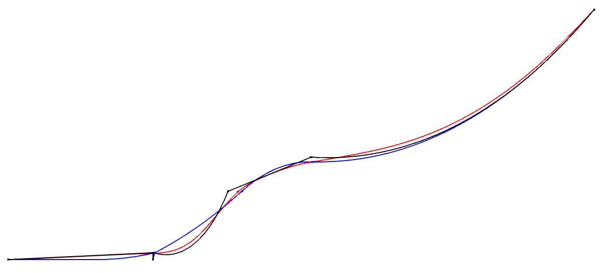

Initialization
==============
.. _initialization:

The system initialization, i.e., the generation of the Initial Condition (IC),
is of paramount importance, as it can significantly impact the performance and
accuracy of the simulation.
Several methods are offered in MoorDyn-C version 2, which can be concatenated
to achieve the required accuracy at a minimum cost.

.. note::
  As of now, only the catenary solver and the so-called Upscaled-drag
  dynamics method are available in MoorDyn-F.

Please refer to the :ref:`V2 Input File documentation <v2_inputs>` for further
information on all the available options to control the system initialization.

Available initialization options:
---------------------------------

Catenary solver
^^^^^^^^^^^^^^^

The catenary solver is always applied, regardless of which other initialization
options are set, mainly because it has a very low performance cost.
However, the catenary solver might fail to find a solution (in which case a
straight-line profile is provided), or the accuracy of the solution might be
insufficient.

The catenary solver is applied before any other initialization method.

Saved state
^^^^^^^^^^^

Usage:

.. code-block:: none

 ---------------------- OPTIONS -----------------------------------------
 lines.txt.ic  fileIC  Load a previously saved state

Right after the catenary solver, a previously saved system state can be loaded.
The system state may be produced with MoorDyn-C version 2 itself or with other
tools like MoorPy:

.. code-block:: python

    import moordyn
    moordyn.moorpy_ic("Mooring/lines.txt", outfile="Mooring/lines.txt.ic")

.. warning::
   Although MoorPy is intended to be 100% compatible with MoorDyn, it is still
   in development, and some features, like rods, are not yet available.

For the sake of the lines, MoorPy internally uses the same catenary solver
described above.
However, other entities like free points, bodies, and rods are also solved,
producing a refined solution with a very low computational cost.

Otherwise, saving the state with MoorDyn-C version 2 can be used to concatenate
system initialization methods, taking advantage of the strengths of each model.

:ref:`Below <initialization_example>` an example is provided.

Upscaled-drag dynamics
^^^^^^^^^^^^^^^^^^^^^^

Usage:

.. code-block:: none

 ---------------------- OPTIONS -----------------------------------------
 ICgenDynamic  1      IC generated by the legacy upscaled-drag dynamics
 CdScaleIC     5      The drag upscaling factor during the IC generation

This method involves running a regular simulation with all the coupled entities
fixed, and the drag coefficients upscaled by the **CdScaleIC** factor.

Given that some system velocity is retained, this method is mainly beneficial
when either the time step is very small or the catenary solver failed to find a
good initial line profile.
Even with a substantial upscaled-drag factor, the dissipation process can be
slow, leading to extended times for velocity reduction and convergence.

Stationary solver
^^^^^^^^^^^^^^^^^

Usage:

.. code-block:: none

 ---------------------- OPTIONS -----------------------------------------
 ICgenDynamic  0      IC generated by the stationary solver

The stationary solver also carries out a simulation with all the coupled
entities fixed.
However, in this simulation, the velocity of each system component is nullified
at the beginning of each step, leaving acceleration as the only driving force
for the system's evolution.

Thus, the stationary solver can be considered the limit of the upscaled-drag
dynamics for an infinitely large **CdScaleIC** factor.
It should be noted, however, that a too-large **CdScaleIC** factor when using
upscaled-drag dynamics may result in a divergent simulation.

This method can produce more accurate results than upscaled-drag dynamics.
On the other hand, if the initial system profile is significantly deviated from
the final solution, this method may require very long simulations to converge.

An initialization practical application
---------------------------------------
.. _initialization_example:

As discussed above, each IC generation method has its strengths and weaknesses.
In simple applications, either the upscaled-drag dynamics or the stationary
solver is usually sufficient.
However, if initialization is a critical part or the system is complex,
concatenating IC generation methods can be very beneficial.

To illustrate this, consider the following system example:

.. code-block:: none

  A complex system which is hard to initialize
  ------------------------- LINE TYPES --------------------------------------------------
  LineType  Diam    MassDenInAir    EA       BA/-zeta    EI    Can   Cat  Cdn   Cdt
  (-)       (m)       (kg/m)        (N)      (Pa-s/-)  (n-m^2) (-)   (-)  (-)   (-)
  cable     0.116      25         362e6      -1.0      38e3    1.0   0.0  1.1   0.008
  bouyancy  0.361      59         362e6      -1.0      38e3    1.0  0.469 2.617 0.345
  nylon     0.116      25         362e6      -1.0      38e3    1.0   0.0  1.1   0.008
  ---------------------- ROD TYPES ------------------------------------
  TypeName      Diam     Mass/m    Cd     Ca      CdEnd    CaEnd
  (name)        (m)      (kg/m)    (-)    (-)     (-)      (-)
  conn          0.116    25        1.1    1.0     1.1      1.0
  conn_stiff    0.116    25        1.1    1.0     1.1      1.0
  clamp         0.116    25        1.2    1.0     1.2      1.0
  ---------------------------- BODIES -----------------------------------------------------
  ID   Attachment  X0     Y0    Z0      r0      p0     y0     Mass  CG*   I*        Volume  CdA*     Ca
  (#)     (-)      (m)    (m)   (m)     (deg)   (deg)  (deg)  (kg)  (m)   (kg-m^2)  (m^3)   (m^2)    (-)
  1      Free      452.0   0    -313.0  0       0      0      29.5   0    0.098     0.014   0.5|0.5  1.0
  ---------------------- RODS ----------------------------------------
  ID   RodType  Attachment  Xa    Ya    Za     Xb     Yb    Zb      NumSegs  RodOutputs
  (#)  (name)    (#/key)    (m)   (m)   (m)    (m)    (m)   (m)     (-)       (-)
  1    clamp       Body1    0.1   0     0.0    -0.1   0     0.0     1         -
  2    conn        Free     375.0 0     -250.0 375.0  0     -250.0  0         -
  3    conn        Free     290.0 0     -215.0 290.0  0     -215.0  0         -
  ----------------------- POINTS ----------------------------------------------
  Node      Type      X        Y         Z        M        V         CdA   CA
  (-)       (-)      (m)      (m)       (m)      (kg)     (m^3)     (m^2)  (-)
  1         Fixed    600.0     0      -320.0       0        0          0     0
  2         Fixed    452.0     0      -320.0       0        0          0     0
  3         Body1    0.0       0         0.0       0        0          0     0
  4         Coupled  0.0       0       -63.6       0        0          0     0
  -------------------------- LINES -------------------------------------------------
  Line     LineType NodeA     NodeB  UnstrLen   NumSegs     Flags/Outputs
  (-)      (-)       (-)       (-)    (m)         (-)          (-)
  1        nylon       2         3      7.0        1           -
  2        cable       1       R1A    150.0       15           -
  3        cable     R1B       R2A    110.0       11           -
  4      bouyancy    R2B       R3A     80.0        8           -
  5        cable     R3B         4    340.0       34           -
  -------------------------- SOLVER OPTIONS---------------------------------------------------
  3.0e6         kb           - bottom stiffness
  3.0e5         cb           - bottom damping
  320           WtrDpth      - water depth
  midpoint5     tScheme      - Time integrator
  0.2           cfl          - Courant-Friedich-Lewy factor
  0             ICgenDynamic - 0 for stationary solver, 1 for upscaled drag legacy solver
  4.0           ICDfac       - factor by which to scale drag coefficients during dynamic relaxation IC gen
  1e-4          threshIC     - threshold for IC convergence
  1.0           dtIC         - Time lapse between convergence tests (s)
  25.0          TmaxIC       - threshold for IC convergence
  --------------------------- need this line -------------------------------------------------

We can try the three initialization methods: the catenary solver alone, the
stationary solver, or the upscaled-drag dynamics, by simply adjusting the
options at the end of the file (only the modified options are documented):

.. code-block:: none

  Catenary solver alone
  -------------------------- SOLVER OPTIONS---------------------------------------------------
  0.0           TmaxIC       - threshold for IC convergence
  --------------------------- need this line -------------------------------------------------

.. code-block:: none

  Stationary solver
  -------------------------- SOLVER OPTIONS---------------------------------------------------
  1e-6          threshIC     - threshold for IC convergence
  100.0         TmaxIC       - threshold for IC convergence
  --------------------------- need this line -------------------------------------------------

.. code-block:: none

  Upscaled-drag dynamics
  -------------------------- SOLVER OPTIONS---------------------------------------------------
  0.05          cfl          - Courant-Friedich-Lewy factor
  1             ICgenDynamic - 0 for stationary solver, 1 for upscaled drag legacy solver
  1e-6          threshIC     - threshold for IC convergence
  100.0         TmaxIC       - threshold for IC convergence
  --------------------------- need this line -------------------------------------------------

It's important to note that for the upscaled-drag dynamics to work effectively,
the time step must be significantly reduced, which increases the computational
cost.

The following figure illustrates the three solutions (Black: Catenary solver;
Red: Stationary solver; Blue: Upscaled-drag dynamics):

As shown, the catenary solver failed to provide an accurate enough initial
system state, which hampered the performance of the stationary solver.
After 100 seconds, the stationary solver still hadn't converged to the correct
solution.

In contrast, the upscaled-drag dynamics converged to a satisfactory solution,
albeit with a significant reduction in the time step.

A practical approach would be to combine the stationary solver and the
upscaled-drag dynamics to achieve an accurate IC with relatively low
computational cost, without compromising the subsequent simulation.
To do this, we can create three versions of the input file: one for the initial
stationary solver, another for the upscaled-drag dynamics IC generation, and a
final one for the actual simulation (only the relevant options are documented):

.. code-block:: none

  riser_ic1.txt: The system boot up with the stationary solver
  -------------------------- SOLVER OPTIONS---------------------------------------------------
  0.25       cfl          - Courant-Friedich-Lewy factor
  0          ICgenDynamic - 0 for stationary solver, 1 for upscaled drag legacy solver
  4.0        ICDfac       - factor by which to scale drag coefficients during dynamic relaxation IC gen
  1e-3       threshIC     - threshold for IC convergence
  0.5        dtIC         - Time lapse between convergence tests (s)
  2.0        TmaxIC       - threshold for IC convergence
  --------------------------- need this line -------------------------------------------------

.. code-block:: none

  riser_ic2.txt: The upscaled-drag to fast converge to a good enough IC
  -------------------------- SOLVER OPTIONS---------------------------------------------------
  0.25       cfl          - Courant-Friedich-Lewy factor
  1          ICgenDynamic - 0 for stationary solver, 1 for upscaled drag legacy solver
  4.0        ICDfac       - factor by which to scale drag coefficients during dynamic relaxation IC gen
  1e-3       threshIC     - threshold for IC convergence
  0.5        dtIC         - Time lapse between convergence tests (s)
  5.0        TmaxIC       - threshold for IC convergence
  riser.ic   fileIC       - Load a quasistatic solution before the IC solver (-)
  --------------------------- need this line -------------------------------------------------

.. code-block:: none

  riser.txt: The riser actual simulation
  -------------------------- SOLVER OPTIONS---------------------------------------------------
  0.5        cfl          - Courant-Friedich-Lewy factor
  0          ICgenDynamic - 0 for stationary solver, 1 for upscaled drag legacy solver
  4.0        ICDfac       - factor by which to scale drag coefficients during dynamic relaxation IC gen
  1e-3       threshIC     - threshold for IC convergence
  1.0        dtIC         - Time lapse between convergence tests (s)
  1.0        TmaxIC       - threshold for IC convergence
  riser.ic   fileIC       - Load a quasistatic solution before the IC solver (-)
  --------------------------- need this line -------------------------------------------------

Below is a Python code snippet to execute the simulation:

.. code-block:: python

    import moordyn

    # 1st IC generation stage: The stationary solver
    system = moordyn.Create("riser_ic1.txt")
    point = moordyn.GetPoint(system, 4)
    r = moordyn.GetPointPos(point)
    v = [0, 0, 0]
    moordyn.Init(system, r, v)
    moordyn.SaveState(system, "riser.ic")
    moordyn.Close(system)
    # 2nd IC generation stage: The dynamic solver
    system = moordyn.Create("riser_ic2.txt")
    point = moordyn.GetPoint(system, 4)
    r = moordyn.GetPointPos(point)
    moordyn.Init(system, r, v)
    moordyn.SaveState(system, "riser.ic")
    moordyn.Close(system)
    # The simulation itself
    system = moordyn.Create("riser.txt")
    point = moordyn.GetPoint(system, 4)
    r = moordyn.GetPointPos(point)
    moordyn.Init(system, r, v)
    T = 10
    A = 0.0
    dt = T / 100
    t = 0.0
    step = 0
    while t <= 1 * T:
        rorg = moordyn.GetPointPos(point)
        rdst = list(rorg)
        rdst[2] = r[2] + A * math.sin(2 * math.pi * (t + dt) / T)
        v = [(rdst[i] - rorg[i]) / dt for i in range(len(rorg))]
        moordyn.Step(system, rorg, v, t, dt)
        try:
            moordyn.SaveVTK(system, f"vtk/out.{step:05d}.vtm")
        except:
            pass
        t += dt
        step += 1
    moordyn.Close(system)

In this script, the system first loads the ``riser_ic1.txt`` input file, runs
the stationary solver, and saves the resulting state, which is then loaded by
the ``riser_ic2.txt`` simulation to run the upscaled-drag simulation.
The final state is saved once more and used by the actual simulation input
file, ``riser.txt``.

As a result, the IC is generated in just 7 seconds with a CFL value of 0.25.
This IC is sufficiently accurate to enable a stable simulation with a CFL of
0.5, leading to a significant improvement in performance.
