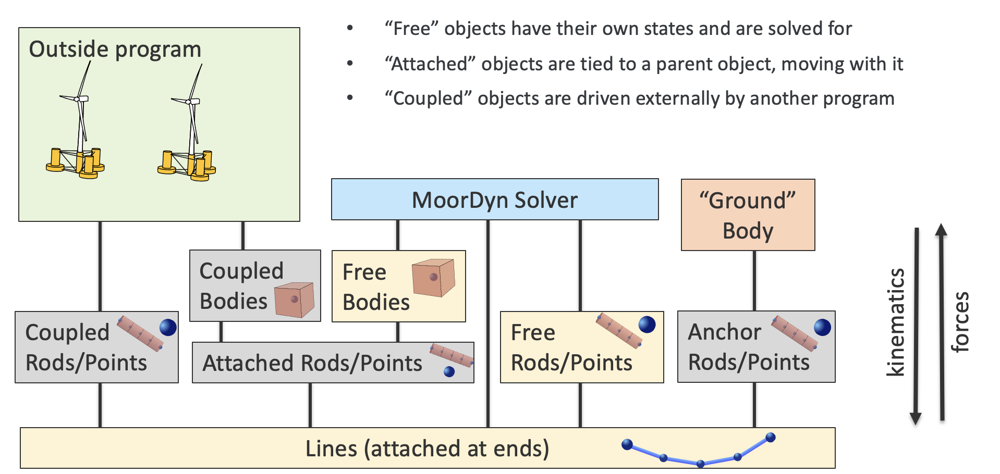

Model Structure
===============
.. _structure:

MoorDyn v2 models the dynamics of mooring structures in an object-oriented approach. There are four 
main object types: Lines, Points, Rods, and Bodies. MoorDyn v1 only contained Lines and Points. 
Lines are the fundamental discretized lumped-mass modeling component. Points and Rods provide a 
means of connecting lines with additional 3- and 6-DOF properties (respectively), and Bodies 
provide a way to create more complex 6-DOF rigid-body assemblies. These objects have predefined 
ways of interacting. Kinematics are passed from the top down and are used to calculate the 
forces which are passed back up to the outside program or to output channels. This hierarchy is 
shown below:

Each object type and its key parameters are detailed in the following sections.

Note: The variables described below are for MoorDyn-C. MoorDyn-F has the same general structure as 
MoorDyn-C, with similar variables. The biggest difference between the codes underlying modeling is 
that in MoorDyn-C quaternions are used to describe the position and orientation of 6DOF objects, 
while in MoorDyn-F traditional Euler angles are used. To read more about quaternions and their 
implementation, refer to the :ref:`theory section <theory>`.

Lines
-----
.. _lines:

MoorDyn uses a lumped-mass approach to discretize the dynamics over the length of the mooring line.  
A line is broken up into N evenly sized line segments connecting N+1 node points. The indexing 
starts at the anchor (or lower end), with the anchor node given a value of zero, and the cable 
segment between nodes 0 and 1 given an index of 1/2.
 
The model uses a right-handed inertial reference frame with the z axis being measured positive up 
from the water plane, consistent with NREL’s FAST simulator.  Each node’s position is defined by a 
vector r.  Each segment of the cable has identical properties of unstretched length, diameter, 
density, and Young's modulus.  Different cables can have different sets of properties, and cables 
can be connected together at the ends, enabling mooring systems with interconnected lines. 

Hydrodynamic loads are calculated directly at the node points rather than at the segment centers. 
This ensures damping of transverse cable vibrations having a wavelength of twice the cable segment 
length. To approximate the cable direction at the node points, the cable tangent at each node is 
assumed to be the average of the tangent directions of the two adjacent cable elements. Aside from 
this detail, the formulation of the mooring model is fairly standard. Further technical details and 
validation results are available in the :ref:`theory section <theory>`.

Bending stiffness is a recent capability addition in MoorDyn-C (it is not yet implemented in 
MoorDyn-F). The word cable is used to refer to a Line object with nonzero bending stiffness.

MoorDyn reads a user defined table of line types from the input file to describe the 
cross-sectional (or per-meter) properties of the mooring lines. Each line type has an alphanumeric 
name to identify it and contains all the properties aside from length and discretization that are 
needed to describe a mooring line in MoorDyn.

Line objects have the following variables:

General:

* *env*: a pointer to the global environment object
* *waves*: a pointer to the global object storing information about waves/currents
* *t*: the simulation time, as a real
* *seafloor*: a pointer to the global object storing the 3d seafloor information

Specific to each Line:

- *N*: int indicating the number of line segments in N
- *UnstrLen*: real indicating the unstretched length of the line
- *d*: real describing the line diameter
- *rho*: real describing the linear density of the line
- *E*: Young's modulus of the line (Pa)
- *EI*: real Bending stiffness (Nm^2)
- *c*: real damping coefficient (Ns). This can be the literal damping coefficient, or a negative 
  value representing fraction of critical damping
- *Can*: real normal added mass coefficient
- *Cat*: real axial added mass coefficient
- *Cdn*: real normal drag coefficient w/r/t frontal area
- *Cdt*: real axial drag coefficient w/r/t surface area
- *Cl*: real VIV cross-flow lift coefficient
- *BAin*: real axial-internal damping
- *A*: real cross sectional area
- *nEApoints*: number of values in stress-strain lookup table
- *stiffXs*: x-array for stress-strain lookup table
- *stiffYs*: y-array of reals for stress-strain lookup table
- *nEIpoints*: number of values in bent-stiffness lookup table
- *bstiffXs*: x-array for bent-stiffness lookup table
- *bstiffYs*: y-array of reals for bent-stiffness lookup table
- *nCpoints*: number of values in stress-strain rate lookup table (0 for constant c)
- *dampXs*: x array for stress-strain rate lookup table
- *dampYs*:  y array for stress-strain rate lookup table

State:

- *r*: a vector of 3D node positions for the nodes representing the line.
- *rd*: a vector of 3D velocities for each of the nodes representing the line

Dynamics: 

- *q*: a vector of 3D tangent vectors for each node
- *qs*: a vector of 3D tangent vectors for each segment
- *l*: a vector of unstretched line segment lengths (as reals)
- *lstr*: a vector of stretched segment lengths (as reals)
- *ldstr*: a vector of reals describing the rate of stretch for each segment
- *Kurv*: a vector of reals describing the curvature at node points
- *M*: a vector of 3x3 matrices describing the mass+added mass of each node in the line
- *V*: a vector of line-segment volumes as reals
- *F*: a vector of reals indicating volume of each segment submerged (1 = fully submerged, 0 = out 
  of water)

Forces are computed at every node in the line. Hence, all line forces are represented as vectors of 
3D force vectors:

- *T*: a vector of 3D vectors describing segment tensions
- *Td*: a vector of 3D vectors describing segment Damping forces
- *Bs*: a vector of 3D vectors describing bending stiffness forces
- *W*: a vector of 3D vectors describing weight (gravity) forces
- *Dp*: a vector of 3D vectors describing node drag (transversal)
- *Dq*: a vector of 3D vectors describing node drag (axial)
- *Ap*: a vector of 3D vectors describing added-mass forcing (Transversal)
- *Aq*: a vector of 3D vectors describing mass-forcing (axial)
- *B*: a vector of 3D vectors describing node bottom contact force
- *Fnet*: a vector of 3D vectors describing total force on each node in the line

.. Waves:
.. 
.. - *zeta*: vector of reals describing free-surface elevations
.. - *PDyn*: vector of reals describing dynamic pressures
.. - *U*: vector of 3D vectors describing wave velocities
.. - *Ud*: vector of 3D vectors describing wave accelerations
.. 

Misc:

- *endTypeA, endTypeB*: indicates whether ends are pinned or cantilevered to rod
- *endMomentA, endMomentB*: 3D moment vectors at ends, to be applied to attached Rod/Body
- *outfile*: pointer to outfile to write to
- *channels*: which channels to write to the outfile

Points
------
.. _points:

Point objects attach to the ends of Lines and can be used to connect Lines to other things
or to each other. (In MAP and older versions of MoorDyn, these objects were called Connections or 
Nodes). A Point has three degrees of freedom and can have any number of Lines attached to it. There 
are three types of Points:

- **Fixed/Anchor/Body**: their location is fixed to an XYZ coordinate (stationary) or a XYZ 
  coordinate in the Body reference frame. They can be used as anchor points or to attach mooring 
  lines to a Body.
- **Coupled/Vessel**: they move under the control of the driver program/script.  
  They can be used as fairlead points when the platform is modeled externally.
  See :ref:`the coupling documentation <coupling>`.
- **Free/Point**: they are free to move according to the forces acting on them, which 
  includes the tensions of attached lines as well as their own self weight and buoyancy, if 
  applicable.  

Free Points facilitate more advanced mooring systems. They can be used to connect two 
or more mooring lines together, to create multi-segmented lines or junctions such as in a 
bridle mooring configuration. If a free Point is given nonzero volume or mass properties,
it can also represent a clump weight or float. 

In MoorDyn-C, "Points" are represented as Point objects.
Currently, every line must have 2
points at each endpoint (Rod ends serve as points). Point objects expose a public member, 
Point::attachment, that contains 1) a pointer to the Line object attached to the point and 2) a 
field indicating which "end" (A or B) of the line is attached to the point.

Points Objects have the following variables:

General:

- *env*: a pointer to a global struct holding environmental settings
- *waves*: a pointer to a global object representing Waves in the system
- *t*: the simulation time, as a real
- *seafloor*: a pointer to the global object storing the 3d seafloor information

Specific to each Point:

- *attached*: a vector of attachments, describing all lines attached to the point
- *pointM*: the mass of the point as a real
- *pointV*: the volume of the point as a real
- *pointF*: a 3D vector of forces on the point
- *pointCdA*: prag coefficient of the point
- *pointCa*: pdded mass coefficient of the point

State:

- *r*: 3D node position
- *rd*: 3D node velocity

Dynamics:

- *r_ves*: 3D fairlead position for coupled points
- *rd_ves*: 3D fairlead velocity for coupled points
- *FNet*: 3D force vector on node
- *M*: 3x3 mass + added mass matrix
- *Acc*: 3D node acceleration vector

.. Waves:
..
.. - *zeta*: real representing free-surface elevation
.. - *PDyn*: dynamic pressure
.. - *U*: Wave velocities
.. - *Ud*: Wave accelerations
.. - *WaterKin*: Flag indicating whether wave/current kinematics will be considered
..

Misc:

- *number*: point ID (unique int)
- *type*: point type, one of moordyn::Point::types

Rods 
----
.. _rods:

Rod objects provide an option for rigid cylindrical elements within a mooring system. They have 
similar modeling details as Lines except for their rigidity, which gives them six degrees of 
freedom. Like Lines, they are divided into nodes at which weight, buoyancy, seabed contact, and 
Morison-based hydrodynamic forces are calculated. Unlike Lines, their internal forces are not 
calculated. Generally, more nodes in a rod increase the accuracy of rod dynamics calculations. The 
end nodes of a rod are available for attachment of lines (specified as "R2A" for end A of Rod 2) 
and can be set up in the :ref:`input file <v2_inputs>`.

Rods can have 6, 3, or 0 DOF. 

- **Fixed**: Rods are full constrained, and their movement is defined by that of a body, the ground, 
  or a coupling point (0 DOF). 
- **Coupled**: They move under the control of the calling program/script (constrained in all 6 DOF).
  See :ref:`the coupling documentation <coupling>`.
- **Free**: Rods are unconstrained to move in all 6 DOF.  
- **Pinned**: The rod end A translational movement is fixed while the rotational movement about end A is free.
- **Coupled pinned**: The rod end A translational movement is coupled while the rotational movement about end A is free.

Pinned or Fixed Rods attached to a body (e.g. body 1) are labelled "Body1Pinned" or "Body1". 
Rods attached to bodies have their coordinates defined in the body reference frame
Pinned or fixed rods that serve as a coupling point are labelled "CoupledPinned" or "Coupled".

A special case exists if a Rod is specified with zero elements: in that case it is given zero 
length, and its end B coordinates in the input file are instead interpreted as vector components to 
describe its direction vector. This case is meant for making cantilever points of a line with 
bending stiffness. A fixed zero-length rod can be used to make a cantilever point of a power cable 
to the ground, a body, or a coupling point. A free zero-length rod can be used to join two 
different types of power cable segments, and it will pass moments between the cable segments 
without adding any mass or other characteristics. In this case, the two cables being joined need 
to be attached to end A and end B respectively (with the rod unit vector pointing from the first to 
the second cable).

Rod objects have the following variables:

General:

- *env*: a pointer to a global struct holding environmental settings
- *waves*: a pointer to a global object representing Waves in the system
- *t*: the simulation time, as a real
- *seafloor*: a pointer to the global object storing the 3d seafloor information

Attachments:

- *attachedA*: A vectors of lines attached to the end point A of the rod
- *attachedB*: A vector of lines attached to the end point B of the rod

Specific to each rod:

- *N*: The number of rod segments
- *UnstrLen*: The constrained length of the rod
- *q0*: The original rod orientation vector
- *d*: Rod diameter
- *rho*: Rod linear density
- *Can*: Normal added mass coefficient 
- *Cat*: Axial added mass coefficient
- *Cdn*: Normal drag coefficient (unused)
- *Cdt*: Axial drag coefficient (unused)
- *CdEnd*: Rod end drag coefficient
- *CaEnd*: Rod end added mass coefficient 

State:

- *r7*: A quaternion describing the rods position
- *v6*: Rod 6dof velocity[vx,vy,vz,wx,wy,wz] (end A velocity and rotational velocities about 
  unrotated axes)
- *vel7*: A quaternion describing the rods velocity that when integrated gives r7. It is equivalent 
  to v6.

Dynamics: 

- *acc6*: Final 6 DOF rod acceleration used for outputs. When integrated gives v6. 
- *r*: 3D vector of node positions
- *rd*: 3D vector of node velocities
- *q*: Unit tangent vector for the rod
- *l*: Rod segment lengths
- *M*: 3x3 node mass and added mass matrix
- *V*: Segment volumes
- *r_ves*: 6D vector of fairlead position for coupled rods
- *rd_ves*: 6D vector of fairlead velocity for coupled rods

Forces:

- *FextA*: A vector of external forces from attached lines on/about end A
- *FextB*: A vector of external forces from attached lines on/about end B
- *Mext*: A vector of external moments (from attached cables or waterplane hydrostatic moment)
- *F6net*: Total force and moment about end A (excluding inertial loads) that Rod may exert on 
  whatever it's attached to
- *M6net*: total 6x6 mass matrix about end A of Rod and any attached Points
- *W*: A vector of node dry weights
- *Bo*: A vector of node buoyancy
- *Pd*: A vector of the Froud-Krylov force
- *Dp*: A vector of node drag forces (axial)
- *Dq*: A vector of node drag forces (transversal)
- *Ap*: A vector of node added mass (transversal)
- *Aq*: A vector of the long wave diffraction force
- *B*: A vector of node bottom contact force
- *Fnet*: A vector of total force on node (depreciated)

Wave stuff:

- *VOF*: VOF submergence scalar for each node (1 = fully submerged, 0 = out of water)
- *h0*: instantaneous axial submerged length

Misc:

- *outfile*: pointer to the main outfile for the rod
- *channels*: which channels to write to the outfile 

Bodies
------
.. _bodies:

Body objects provide a generic 6 DOF rigid-body representation based on a lumped-parameter model of 
translational and rotational properties (e.g. hydrodynamic drag and added mass coefficients). Rod 
elements can be added to bodies and mooring lines can be attached at any location, allowing a wide 
variety of submerged structures to be integrated into the mooring system. The body itself does not 
have a defined geometry (the volume is only used in buoyancy calculations), rather its geometry is 
defined by the rods attached to it. Therefore, for simplicity, any hydrodynamic loads associated 
with a body on its own (with no attached objects) are always calculated as though the body is fully 
submerged. Partial submergence is handled in any attached objects. Aside from contributions which 
might come from incorporated Rod objects or attached Point and Line objects, the core Body object 
properties are as follows:

- *mass, and center of mass*
- *volumetric displacement (assumed to be at reference point)*
- *mass moment of inertia about each axis*
- *hydrodynamic drag coefficient in each direction*
- *rotational hydrodynamic drag coefficient about each axis*
- *added mass coefficient in each direction*
- *added mass moment of inertia coefficient about each axis*

There are three possible types 
for bodies:

- **Free**: the body kinematics are computed by MoorDyn based on the applied loads and inertia
- **Fixed**: the body is fixed, either to a particular location or to a connected, moving entity.
- **Coupled**: the body kinematics are controlled by the calling program.
- **Coupled pinned**: The body's translational movement is coupled while the rotational movement is free.

Body objects have the following variables:

General:

- *env*: a pointer to a global struct holding environmental settings
- *waves*: a pointer to a global object representing Waves in the system

Attachments:

- *attachedP*: a vector of pointers to point objects, indicating all the points attached to the 
  body
- *attachedR*: a vector of pointers to Rod objects attached to the body. 
- *rPointRel*: a vector of 3d vectors describing the attachment points locations for Points
- *r6RodRel*: a vector<vec6> of 6D vectors describing the attachment points and orientation of 
  each rod.

Body Properties. Note that these are all set to zero for all Body types
other than FREE, as they are not relevant to COUPLED or FIXED scenarios:

- *body_r6*: 6D reference point for the body.
- *body_rCG*: 3D location of body center-of-gravity
- *bodyM*: real number describing the body's mass
- *bodyV*: real number describing the body's displaced volume
- *bodyI*: 3d Vector describing the inertia diagonal components of the body
- *bodyCdA*: 6D vector describing the body's drag coefficients
- *bodyCa*: 6D vector describing added-mass coefficients

State:

- *r7*: quaternion describing body's position
- *v6*: 6D vector describing body's velocity
- *dPos*: quaternion describing the body’s velocity that when integrated gives r7. It is equivalent 
  to v6. 

Dynamics and Forces:

- *a6*: 6D vector of body acceleration that when integrated gives v6. 
- *r_ves*: 6D vector describing fairlead position if a coupled body (may be different than 
  overall r6)
- *rd_ves*: 6D vector describing fairlead velocity if a coupled body (may be different than 
  overall v6)
- *F6net*: 6D vector describing total force/moment vector on node
- *M*: 6x6 matrix representing total body mass + added mass
- *M0*: 6x6 matrix representing 'starting mass' matrix of body, not taking into account rod 
  elements.
- *OrMat*: 3x3 matrix representing orientation of the body

.. Waves:
..
.. - *U*: 3D vector of wave velocity at reference point
.. - *Ud*: 3D vector of wave acceleration at reference point
..
  
Misc:

- *number*: a unique int id identifying the body
- *type*: FREE, COUPLED, or FIXED, describing the "type" of body to be modeled
- *outfile*: pointer to the main output file for the body
