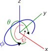

.. _structure:

Model Structure
===============

MoorDyn Objects
---------------
MoorDyn models the dynamics of mooring structures in an object-oriented programming (OOP) approach.
The overall simulation is managed by the MoorDyn2 class. This class reads inputs, allows models to
be loaded and saved, contains various environmental parameters (e.g. time-steps sizes and filepaths)
and most importantly contains pointers to all the Objects representing physical parts of the model
(Lines, Bodies, Rods, Points). 

Lines
^^^^^

MoorDyn uses a lumped-mass approach to discretize the dynamics over the length of the mooring line.  
A line is broken up into N evenly-sized line segments connecting N+1 node points.  The indexing starts at the anchor (or lower end), 
with the anchor node given a value of zero, and the cable segment between nodes 0 and 1 given an index of 1/2.
 
The model uses a right-handed inertial reference frame with the z axis being measured positive up from the water plane, 
consistent with NREL’s FAST simulator.  Each node’s position is defined by a vector r.  Each segment of the cable has 
identical properties of unstretched length, diameter, density, and Young's modulus.  Different cables can have different 
sets of properties, and cables can be connected together at the ends, enabling mooring systems with interconnected lines. 

Hydrodynamic loads are calculated directly at the node points rather than at the segment centers.  This ensures damping of 
transverse cable vibrations having a wavelength of twice the cable segment length.  To approximate the cable direction at 
the node points, the cable tangent at each node is assumed to be the average of the tangent directions of the two 
adjacent cable elements.  Aside from this detail, the formulation of the mooring model is fairly standard.  
Further technical details and some validation results are available in :ref:`some papers <theory>`.

Bending stiffness is a recent capability addition in MoorDyn v2 (it is not yet implemented in MoorDyn-F). 
In the explanations that follow, the word cable is used to refer to a Line object with nonzero bending stiffness.

MoorDyn keeps a dictionary of line types to describe the cross-sectional 
(or per-meter) properties of the mooring lines. Each line type has an alphanumeric name
to identify it, and contains all the properties aside from length and discretization that
are needed to describe a mooring line in MoorDyn.

Line objects maintain the following Data Members:

General:

- env: a pointer to the global environment object
- waves: a pointer to the global object storing information about waves/currents
- t: the simulation time, as a real

Specific to each Line:

- N: int indicating the number of line segments in N
- UnstrLen: real indicating the unstretched length of the line
- d: real describing the line diameter
- rho: real describing the linear density of the line
- E: Young's modulus of the line (Pa)
- EI: real Bending stiffness (Nm^2)
- c: real damping coefficient (Ns). This can be the literal damping coefficient, or a negative value representing
fraction of critical damping
- Can: real normal added mass coefficient
- Cat: real axial added mass coefficient
- Cdn: real normal drag coefficient w/r/t frontal area
- Cdt: real axial drag coefficient w/r/t surface area
- BAin: real axial-internal damping
- A: real cross sectional area
- nEApoints: number of values in stress-strain lookup table
- stiffXs: x-array for stress-strain lookup table
- stiffYs: y-array of reals for stress-strain lookup table
- nEIpoints: number of values in bent-stiffness lookup table
- bstiffXs: x-array for bent-stiffness lookup table
- bstiffYs: y-array of reals for bent-stiffness lookup table

State:

- r: a vector of 3D node positions for the nodes representing the line.
- rd: a vector of 3D velocities for each of the nodes representing the line
- q: a vector of 3D tangent vectors for each node
- qs: a vector of 3D tangent vectors for each segment
- l: a vector of unstretched line segment lengths (as reals)
- lstr: a vector of stretched segment lengths (as reals)
- ldstr: a vector of reals describing the rate of stretch for each segment
- Kurv: a vector of reals describing the curvature at node points
- M: a vector of 3x3 matrices describing the mass+added mass of each node in the line
- V: a vector of line-segment volumes as reals

Forces are computed at every node in the line. Hence, all line forces are represented as std::vectors of 3D force vectors:

- T: a vector of 3D vectors describing segment tensions
- Td: a vector of 3D vectors describing segment Damping forces
- Bs: a vector of 3D vectors describing bending stiffness forces
- W: a vector of 3D vectors describing weight (gravity) forces
- Dp: a vector of 3D vectors describing node drag (transversal)
- Dq: a vector of 3D vectors describing node drag (axial)
- Ap: a vector of 3D vectors describing added-mass forcing (Transversal)
- Aq: a vector of 3D vectors describing mass-forcing (axial)
- B: a vector of 3D vectors describing node bottom contact force
- Fnet: a vector of 3D vectors describing total force on each node in the line

Waves:

- F: a vector of reals indicating volume of each segment submerged (1 = fully submerged, 0 = out of water)
- zeta: vector of reals describing free-surface elevations
- PDyn: vecctor of reals describing dynamic pressures
- U: vector of 3D vectors describing wave velocities
- Ud: vector of 3D vectors describing wave accelerations

Misc.

- endTypeA, endTypeB: indicates whether ends are pinned or cantilevered to rod
- endMomentA, endMomentB: 3D moment vectors at ends, to be applied to attached Rod/Body
- outfile: pointer to outfile to write to
- channels: which channels to write to the outfile

Points
^^^^^^
.. _points:

Point objects attach to the ends of Lines and can be used to connect Lines to other things
or to each other. (In MAP and older versions of MoorDyn, these objects were called Points).
A Point has three degrees of freedom and can have any number of Lines attached to it. 
There are three types of Points:

- **Fixed**: their location is fixed to ground (stationary) or a Body object. 
  They can be used as anchor points or as a way to attach mooring Lines to a Body.
- **Coupled**: they move under the control of the calling program/script.  
  They can be used as fairlead points when the platform is modeled externally.
  See :ref:`the coupling documentation <coupling>`.
- **Free**: they are free to move according to the forces acting on them, which includes
  the tensions of attached lines as well as their own self weight and buoyancy, if applicable.  

Free Points facilitate more advanced mooring systems. They can be used to connect two 
or more mooring lines together, to create multi-segmented lines or junctions such as in a 
bridle mooring configuration. If a free Point is given nonzero volume or mass properties,
it can also represent a clump weight or float. 

In the C++ API, "Points" are represented as Point objects (as their principle purpose
is to connect different lines/bodies/rods together). Currently, every line must have 2
Points at each endpoint. Point objects expose a public member, Point::attachment,
that contains 1. a pointer to the Line object attached to the point and 2. a field indicating
which "end" (A or B) of the line is attached to the point.

Points Objects have the following data members:

General:

- env: a pointer to a global struct holding environmental settings
- waves: a pointer to a global object representing Waves in the system

Specific to each Point:

- attached: a vector of attachments, describing all lines attached to the Point
- conM: the mass of the point as a real
- conV: the volume of the point as a real
- conF: a 3D vector of forces on the point
- conCdA: Drag coefficient of the point
- conCa: Added mass coefficient of the point

State:

- r: 3D node position
- rd: 3D node velocity
- FNet: 3D force vector on node
- M: 3x3 mass + added mass matrix

Waves:

- zeta: real representing free-surface elevation
- PDyn: dynamic pressure
- U: Wave velocities
- Ud: Wave accelerations

Misc:

- number: point ID (unique int)
- type: Point type, one of moordyn::Point::types
- WaterKin: Flag indicating whether wave/current kinematics will be considered:

Rods 
^^^^

Rod objects provide an option for rigid cylindrical elements within a mooring system. They have similar modeling details as 
Lines except for their rigidity, which reduces their degrees of freedom to six. Like Lines, they are divided into a number 
of nodes at which weight, buoyancy, seabed contact, 
and Morison-based hydrodynamic forces are calculated. Unlike Lines, their internal forces are not calculated. 
The end nodes of a rod are available for attachment of lines (specified like "R2A" for end A of Rod 2).

Rods can have 6, 3, or 0 DOF. 

- **Fixed**: Rods are full constrained, and their movement is defined by that of a body, the ground, or a coupling point.
- **Pinned**: Rods are attached at end A to something else, whether that is a body, the ground, or a coupling point. 
  This type of Rod only has three rotational degrees of freedom, about end A.
- **Coupled**: They move under the control of the calling program/script.
  See :ref:`the coupling documentation <coupling>`.
- **Free**: Rods are unconstrained to move in all 6 DOF.  

Pinned or Fixed Rods attached to a body (e.g. body 1) are labelled "Body1Pinned" or "Body1". 
Pinned or fixed rods that serve as a coupling point are labelled "CoupledPinned" or "Coupled"

As it happens with other entities, rods are computed considering a simplified
Hydrodynamic model. Thus there are situations which are not properly handled,
like surfaced rods with the free surface oriented along the main axis.
In such case it is strongly recommended to set the rod "coupled" and apply an
external solver.

A special case exists if a Rod is specified with zero elements: in that case it is given zero length, and
its end B input coordinates are instead interpreted as vector components to describe its direction vector. 
This case is meant for convenience when making cantilever points of a line with bending stiffness. 
A fixed zero-length rod can be used to make a cantilever point of a power cable to the ground, a body, or a coupling point.
A free zero-length rod can be used to join two different types of power cable segments, and it will pass moments 
between the cable segments without adding any mass or other characteristics.

Bodies
^^^^^^

Body objects provide a generic 6 DOF rigid-body representation based on a lumped-parameter model of translational 
and rotational properties (e.g. hydrodynamic drag and added mass coefficients). 
Rod elements can be added to bodies and mooring lines can be attached at any location, 
allowing a wide variety of submerged structures to be integrated into the mooring system. 
Aside from contributions which might come from incorporated Rod objects or attached Point 
and Line objects, the core Body object properties are as follows:

- mass, and center of mass
- volumetric displacement (assumed to be at reference point)
- mass moment of inertia about each axis
- hydrodynamic drag coefficient in each direction
- rotational hydrodynamic drag coefficient about each axis
- added mass coefficient in each direction
- added mass moment of inertia coefficient about each axis

In the C++ API, Bodies are represented as a standalone class. This class can have different behaviors
depending on it's "type" (in the intuitive sense, not in the C++ sense) - there are three possible types 
for bodies:

- **Fixed**: the body is fixed, either to a particular location or to a connected, moving entity.
- **Coupled**: the body position is controlled by the calling program.
  See :ref:`the coupling documentation <coupling>`.
- **Free**: the body position is free to move, controlled by the hydrodynamic forces implemented in MoorDyn

Body objects have the following data members:

General:

- env: a pointer to a global struct holding environmental settings
- waves: a pointer to a global object representing Waves in the system

Unique to Body:

Attachments:

- attachedP: a vector of pointers to Point objects, indicating all the points attached to the body
- attachedR: a vector of pointers to Rod objects attached to the body. 
- rConnectRel: a vector<vec> of 3d vectors describing the attachment points locations for Points
- r6RodRel: a vector<vec6> of 6D vectors describing the attachment points and orientation of eac rod.

Body Properties (set upon call to Body::setup()). Note that these are all set to zero for all Body types
other than FREE, as they are not relevant to COUPLED or FIXED scenarios:

- body_r6: 6D reference point for the body.
- body_rCG: 3D location of body center-of-gravity
- bodyM: real number describing the body's mass
- bodyV: real number describing the body's volume
- bodyI: 3d Vector describing the inertia diagonal components of the body
- bodyCdA: 6D vector describing the body's drag coefficients
- bodyCa: 6D vector describing added-mass coefficients

Values describing the body's state:

- r6: 6D vector describing body's position
- v6: 6D vector describing body's velocity
- r_ves: 6D vector describing fairlead position if a coupled body (may be different than overall r6)
- rd_ves: 6D vector describing fairlead velocity if a coupled body (may be different than overall v6)
- F6net: 6D vector describing total force/moment vector on node
- M: 6x6 matrix representing total body mass + added mass
- m0: 6x6 matrix representing 'starting mass' matrix of body, not taking into accound rod elements.
- OrMat: 3x3 matrix representing orientation of the body
- U: 3D vector of wave velocity at reference point
- Ud: 3D vector of wave acceleration at reference point
- outfile: pointer to the main output file for the body

Misc:

- number: a unique int id identifying the body
- type: FREE, COUPLED, or FIXED, describing the "type" of body to be modeled

Angles criteria
---------------

In the following figure the angles criteria is schematically depicted:

Indeed, the roll and heading angles, :math:`\phi` and :math:`\psi`, follow the
right hand criteria, while the pitch angle, :math:`\theta`, follows the left
hand criteria.
This way the classic rotation matrices can be considered,

.. math::
   \begin{alignat}{1}
   R_x(\phi) &= \begin{bmatrix}
   1 &  0         &  0           \\
   0 &  \cos \phi & -\sin \phi \\[3pt]
   0 &  \sin \phi & \cos \phi \\[3pt]
   \end{bmatrix} \\[6pt]
   R_y(\theta) &= \begin{bmatrix}
   \cos \theta & 0 & \sin \theta \\[3pt]
   0           & 1 &  0           \\[3pt]
   -\sin \theta & 0 &  \cos \theta \\
   \end{bmatrix} \\[6pt]
   R_z(\psi) &= \begin{bmatrix}
   \cos \psi & -\sin \psi & 0 \\[3pt]
   \sin \psi &  \cos \psi & 0 \\[3pt]
   0         &  0         & 1 \\
   \end{bmatrix}
   \end{alignat}

which allows to compute moments just by simple cross products,
:math:`\boldsymbol{M} = \boldsymbol{r} \times \boldsymbol{F}`.

Please, notice that in MoorDyn the z axis is considered the upwards direction,
i.e. the gravity points towards -z direction.
Thus, the North-East-Down (NED) angles criteria widely applied in naval
architecture does not match the MoorDyn one.
More specifically, the pitch and heading angles shall be inverted whereas roll
angle remains the same.
