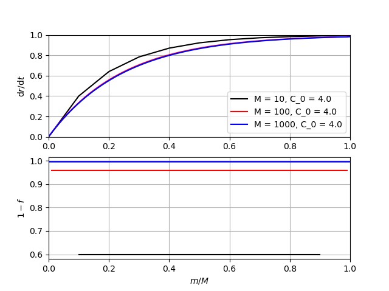

Time Schemes
============
.. _tschemes:

MoorDyn advances a time step by calculating the state derivative of all 
the objects (free and pinned bodies and rods, free points, and lines). It 
then integrates this state derivative to determine the system state at the
next time step. The time integration is performed by a time scheme, which 
are detailed in this section. The following figure demonstrates the general
flow of the time integration process:

MoorDyn-C version 2 is deployed with several time schemes, with different
features, strengths and weaknesses as detailed in this section. The time schemes 
can be divided into 2 main categories: Explicit and implicit.

MoorDyn-F only uses the Runge-Kutta 2 (RK2) or Runge-Kutte 4 (RK4) time schemes 
in the interest of efficiency for OpenFAST simulations.

.. note::
   In both MoorDyn C and F, the default time scheme is RK2

Explicit:
---------

The explicit time schemes are the ones formulated in a way that the derivatives
can be evaluated with the information already available, in contrast to the
implicit ones in which the derivative is required to evaluate the derivative
itself, as it is discussed below.

In general the explicit time schemes are simpler. Unfortunately that simplicity
is usually coming at the cost of a more unstable behavior.

The available explicit schemes are:

Euler
^^^^^

Usage:

.. code-block:: none

 ---------------------- OPTIONS -----------------------------------------
 euler  tscheme      1st order Euler scheme

The simplest scheme, in which the state variables :math:`r` are updated
according to the expression:

.. math::
   r(t_{n+1}) = r(t_n) + \Delta t \frac{\mathrm{d} r}{\mathrm{d} t}(t_n)

It has a 1st order convergence, with a relatively good stability region.

Local-time-step Euler
^^^^^^^^^^^^^^^^^^^^^

Usage:

.. code-block:: none

 ---------------------- OPTIONS -----------------------------------------
 leuler tscheme      1st order Euler scheme (with local time step)

It is a variation of the conventional explicit Euler scheme, in which the system
subentities derivatives are not computed each time step, but the operation can
be delayed depending on the CFL factor.

This time scheme can be of use when several relatively less relevant entities
are enforcing the usage of very small time steps (see
:ref:`Troubleshooting <troubleshooting>`)

Heun
^^^^

Usage:

.. code-block:: none

 ---------------------- OPTIONS -----------------------------------------
 heun   tscheme      1st order Heun scheme

A slight variation of the Euler method, which increases the order applying a
predictor-corrector. The performance can be expected to be rather similar to
the Euler scheme.

Runge-Kutta
^^^^^^^^^^^

Usage:

.. code-block:: none

 ---------------------- OPTIONS -----------------------------------------
 rk2    tscheme      2nd order Runge-Kutta

Runge-Kutta schemes are probably the most popular explicit schemes. Please,
check the
`Wikipedia entry <https://en.wikipedia.org/wiki/Runge%E2%80%93Kutta_methods>`_.

The Runge-Kutta methods are increasing the convergence order and the stability
region. However, to this end they are including more time derivatives
computation within each time step. Anyway, in general the time step enlargement
compensates the extra derivatives.

In MoorDyn the 2nd, 3rd and 4th order variants are available. Just replace the
the integer suffix of the option, i.e. rk\ *N* with *N* 2, 3 or 4.

Adams-Bashforth
^^^^^^^^^^^^^^^

Usage:

.. code-block:: none

 ---------------------- OPTIONS -----------------------------------------
 ab2    tscheme      2nd order Adams-Bashforth

The Adams-Bashforth methods are the explicit counterpart of the Runge-Kutta one,
in the sense that they try to increase the convergence order without adding
more time derivatives within each time step. Please check the
`Wikipedia entry <https://en.wikiversity.org/wiki/Adams-Bashforth_and_Adams-Moulton_methods>`_.

Unfortunately, that comes at the cost of reduced stability regions, i.e. the
time step shall be decreased to compensate this.

In MoorDyn the 2nd, 3rd, 4th and 5th order Adams-Bashforth methods are
available. Just replace the the integer suffix of the option, i.e. ab\ *N* with
*N* 2, 3, 4 or 5.

Local-time-step Adams-Bashforth
^^^^^^^^^^^^^^^^^^^^^^^^^^^^^^^

Usage:

.. code-block:: none

 ---------------------- OPTIONS -----------------------------------------
 lab2   tscheme      2nd order Adams-Bashforth (with local time step)

Similarly to the Euler scheme, the Adams-Bashforth schemes have a variant with
local-time-steps, which can be of use when there are entities relatively less
important which are enforcing small time steps.

Implicit:
---------

The implicit time schemes are the ones formulated in a way that the derivatives
depends on theirselves. The backward Euler method is very illustrative. In such
scheme the state variables :math:`r` are updated according to the expression:

.. math::
   r(t_{n+1}) = r(t_n) + \Delta t \frac{\mathrm{d} r}{\mathrm{d} t}(t_{n+1})

so to evaluate the derivative on :math:`t_{n+1}` we need to know
:math:`r(t_{n+1})`, which depends on the derivative itself.

On MoorDyn this problem is addressed by means of a semi-implicit scheme, i.e.
an iterative process in which the time derivatives are progressively improved.

The implicit time schemes enjoy a way better stability. Even more, the Newmark
scheme is unconditionally stable. Then, what is the catch? Well, they can turn
unstable on the internal iterative process. The half good news is that, by
construction, relaxation can be applied on the internal iterative process.

Hereby an arbitrarily large time step can be considered, provided that a
sufficiently large number of substeps are configured. See
:ref:`the relaxation process <relaxation>` below.

The number of substeps is set as a suffix number on the time scheme name (see
:ref:`the version 2 options <v2_inputs>`.
For instance, setting a "beuler5" time scheme options means that a
Backward-Euler scheme, with 5 substeps, will be considered.
The number of substeps might be any integer bigger than 0.

Backward-Euler
^^^^^^^^^^^^^^

Usage:

.. code-block:: none

 ---------------------- OPTIONS -----------------------------------------
 beuler5  tscheme      5 substeps Backward Euler scheme

As discussed above, the backward Euler scheme is formulated as:

.. math::
   r(t_{n+1}) = r(t_n) + \Delta t \frac{\mathrm{d} r}{\mathrm{d} t}(t_{n+1})

Backward Euler schemes are usually very stable due to the large numerical
dissipation they ussually introduce on the process.
However, its good stability features are so far hampered by the fact that the
derivative is evaluated at the end of the time step, which would drive the
inner iterative process to a divergent stage.

Midpoint
^^^^^^^^

Usage:

.. code-block:: none

 ---------------------- OPTIONS -----------------------------------------
 midpoint5  tscheme      5 substeps Midpoint scheme

The midpoint scheme is evaluated as:

.. math::
   r(t_{n+1}) = r(t_n) + \Delta t \frac{\mathrm{d} r}{\mathrm{d} t}(t_{n+1/2})

i.e. the derivative is evaluated on the center of the time step.
Midpoint schemes are popular because their great conservation properties when
modelling Hamiltonian systems.
The numerical tests seems to show that the Midpoint scheme exposes the bests
performance of all time schemes, being able to keep the stability and get a
great accuracy with relatively low number of substeps.

Backward-Euler with Anderson's acceleration
^^^^^^^^^^^^^^^^^^^^^^^^^^^^^^^^^^^^^^^^^^^

Usage:

.. code-block:: none

 ---------------------- OPTIONS -----------------------------------------
 anderson5  tscheme      5 substeps Backward Euler accelerated scheme

This is the same scheme than the Backward-Euler scheme, but with
`Anderson accelration <https://en.wikipedia.org/wiki/Anderson_acceleration>`_.
Unfortunately, to be able to enjoy the acceleration a large number of substeps
is usually required, making this scheme actually quite useless.

Average Constant Acceleration
^^^^^^^^^^^^^^^^^^^^^^^^^^^^^

Usage:

.. code-block:: none

 ---------------------- OPTIONS -----------------------------------------
 aca5  tscheme      5 substeps Average Constant Acceleration scheme

This is the most popular
`Newmark-Beta scheme <https://en.wikipedia.org/wiki/Newmark-beta_method>`_.
It is unconditionally stable for the kind of systems considered on MoorDyn.
Unfortunately it is affected by the same problem than the Backward-Euler
scheme, i.e. the derivatives are evaluated at the end of the time step, which
might result on divergent inner iterative processes.

Wilson-theta scheme
^^^^^^^^^^^^^^^^^^^

Usage:

.. code-block:: none

 ---------------------- OPTIONS -----------------------------------------
 wilson5  tscheme      5 substeps Wilson-theta scheme

The Wilson-theta scheme is some sort of exacerbated Backward Euler scheme, i.e.
the derivative is evaluated beyond the time step itself:

.. math::
   r(t_{n+1}) = r(t_n) + \Delta t \frac{\mathrm{d} r}{\mathrm{d} t}(t_{n+1+\theta})

In MoorDyn-C the popular value :math:`\theta = 1.37` is considered.
This scheme is trying to get the Backward-Euler characteristic dissipation
to a higher level.
Unfortunately, it is again affected by the eventual divergent inner iterative
processes.

Semi-implicit relaxation
------------------------
.. _relaxation:

All the implicit time schemes are solved as semi-implicit iterative process with
relaxation. Relaxation is the process of mixing the last acceleration prediction
with the previous one,

.. math::
   \frac{\mathrm{d} r}{\mathrm{d} t}(t, m + 1) =
   (1 - f) * \frac{\mathrm{d} r}{\mathrm{d} t}(t, m) +
   f * \frac{\mathrm{d} r}{\mathrm{d} t}(t, \frac{\mathrm{d} r}{\mathrm{d} t}(t, m))

In the expression above, :math:`1 - f` is the so-called relaxation factor. In
MoorDyn, for the sake of consistency,  a relaxation factor :math:`1 - f > 0` is
considered for all the internal steps except the last one, in which no
relaxation is considered.

Hereby, if the iterative process has not reached a
sufficiently close derivative by the last step, the simulation will become
unstable.
However, if the relaxation factor is not small enough, the internal process is
becoming unstable on its own.
So the questionmark is, what is the optimal relaxation factor?

Simple oraculus example
^^^^^^^^^^^^^^^^^^^^^^^

There is probably not an answer for the question above.
However we can investigate a bit about
different alternatives. To illustrate the process, we start with a simple
example in which we have an oraculus which is always providing us with the exact
solution (so no relaxation would be required at all). We are not interested on
the results, which are obviously correct as long as the last step is never
considering relaxation, but on the way the solution is approximating to the
final answer.

One possible relaxation factor would be a constant one:

.. math::
   f = C_0 * (1 / M)

with :math:`M` the number of internal iterations and :math:`C_0` an arbitrary
constant. If :math:`C_0` is too small (0.5 for instance), the acceleration would
never get sufficiently close to the final one, so a big jump would be required
on the last internal iteration:

Relatively large relaxation factors would be required to avoid that,

making the algorithm prone to stability issues. Optimally we want something that
give us small relaxation factors at the beginning, where the solution is more
prone to get unstable, growing afterwards to get as close as possible to the
final solution.

To this end we can draft a different relaxation factor:

.. math::
   f = C_1 * \mathrm{tanh}(m / M)

with :math:`C_1` another arbitrary constant. Again, if :math:`C_1` is too small
jumps at the end will be observed:

so a relatively large one shall be used:

Effectively, the new relaxation factor start with larger relaxations, while at
some point the relaxation becomes smaller than the one obtained by the
constant approach.

However, the relaxations at the beginning might be too large, rendering
the iterative process slugish. Maybe a combination of both algorithms would
outperform each of them separately:

.. math::
   f = C_0 * (1 / M) + C_1 * \mathrm{tanh}(m / M)

Spring example
^^^^^^^^^^^^^^

To test that, let's move to a bit more complex example. Let's consider the
following differential equation:

.. math::
  \frac{\mathrm{d}^2 r}{\mathrm{d} t^2}(t) = -\omega^2 r(t)

With the initial condition :math:`r(t=0) = r_0`,
:math:`\mathrm{d}r / \mathrm{d}t (t=0) = 0`. The initial value problem has then
the following solution:

.. math::
  r(t) = r_0 \mathrm{cos}(\omega t)

It should be noticed that this differential problem is just a simplification
of the spring problem that has to be faced internally by MoorDyn to solve the
lines axial stiffness (see :ref:`Troubleshooting <troubleshooting>`).
  
For simplicity let's consider :math:`\omega = 2 \pi`, so the solution has a
period :math:`T = 1`.
It shall be noticed that the time step on MoorDyn is enforced by the line
segments natural period (as it is documented on the
:ref:`Troubleshooting section <troubleshooting>`), which is in general lower
than the physical scales of the line itself that the user is interested on.
We are hereby interested on knowing which set of constants is more proficient
keeping the stability, i.e. which one can iterate a larger time step without
turning unstable.

To this end, let's consider just the first step of a backward Euler's iterator,
with a time step :math:`\Delta t`:

.. math::
  r(\Delta t) = r_0 +
      \frac{1}{2} \Delta t^2 \frac{\mathrm{d}^2 r}{\mathrm{d} t^2}(\Delta t)

with

.. math::
  \frac{\mathrm{d}^2 r}{\mathrm{d} t^2}(\Delta t) = -\omega^2 r(\Delta t)

Thus, combining both equations and rearraging the terms we can get that the
position at the end of the first time step will be

.. math::
  r(\Delta t) = \frac{r_0}{1 + \frac{1}{2} (\omega \Delta t)^2}

and therefore :math:`r(\Delta t) < r_0`, i.e. it is unconditionally stable,
provided that we can find an algorithm that is able to converge. After a
numerical investigation we can determine that the optimal constants are:

.. math::
  C_0 = \left\lbrace \substack{
      0.1 - 0.01 * M \, \, \mathrm{if} \, \, M < 10 \\
      0.07           \, \, \mathrm{if} \, \, M \be 10
  } \right.

.. math::
  C_1 = \left\lbrace \substack{
      0                            \, \, \mathrm{if} \, \, M < 10 \\
      \frac{1}{10.0 + 0.051 * M^2} \, \, \mathrm{if} \, \, M \be 10
  } \right.

i.e. the :math:`\mathrm{tanh}` relaxation factor is aidded by a constant one
for a small number of iterations.
With such a set of constants the resulting speedup can be plotted:

As expected, the larger the number of iterations, the larger speedup.

On MoorDyn-C each semi-implicit time scheme has its own relaxation constants,
obtained numerically to achieve good stability features
