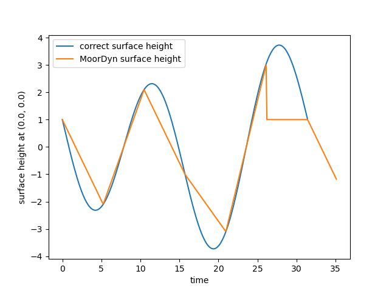
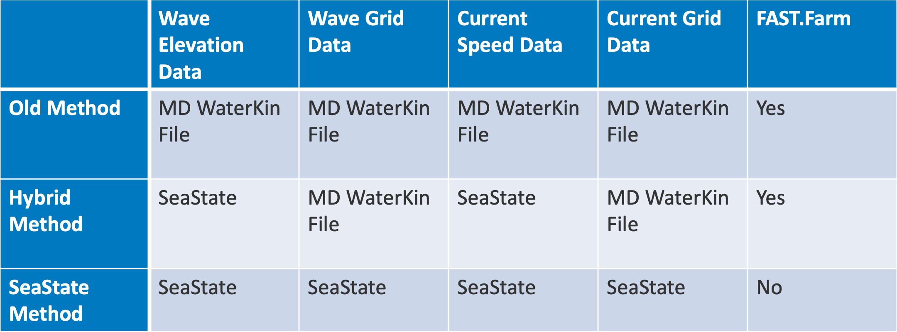

Water Kinematics in MoorDyn
===========================
.. _waterkinematics:

MoorDyn has support for specifying water currents as well as waves in a variety of ways.

Wave Kinematics (MoorDyn-C)
---------------------------
Below are the possible values for the WaveKin option in the MoorDyn-C input file along with 
descriptions and instructions for use. 

WaveKin = 0 (None)
^^^^^^^^^^^^^^^^^^

Assumes there are no waves.
The water surface is still and at z=0.0.

WaveKin = 1 (Externally Driven Waves)
^^^^^^^^^^^^^^^^^^^^^^^^^^^^^^^^^^^^^

This gives you the ability to set and change the wave kinematics as part of the stepping loop.
This uses the ``Moordyn_ExternalWaveKin*`` family of functions to initialize
and set the wave kinematics as frequently as you want.

.. doxygenfunction:: MoorDyn_ExternalWaveKinInit
.. doxygenfunction:: MoorDyn_ExternalWaveKinGetN
.. doxygenfunction:: MoorDyn_ExternalWaveKinGetCoordinates
.. doxygenfunction:: MoorDyn_ExternalWaveKinSet

A standard usage of external wave kinematics would be in some situations where you have your own 
code or an external program computing the fluid dynamics and you want MoorDyn to use those values.

Below is an example program demonstrating basic usage of external wave kinematics.

.. code-block:: c

    #include <iostream>
    #include <moordyn/MoorDyn2.h>
    using namespace std;

    void
    get_water_kinematics(double t, const double* r, double* u, double* du)
    {
        // this function could call an external program, do its own computation,
        // lookup a precalculated value, etc
        u[0] = 1.0; // x velocity
        u[1] = 0.0; // y velocity
        u[2] = 0.0; // z velocity
        du[0] = 0.0; // x acceleration
        du[1] = 0.0; // y acceleration
        du[2] = 0.0; // z acceleration
    }
    bool main() 
    {

        int err;

        MoorDyn system = MoorDyn_Create("Mooring/lines.txt");
        if (!system) {
            cerr << "Failure Creating the Mooring system" << endl;
            return false;
        }

        // If you're dealing with coupled DOF's that could happen here
        // If not you can just pass in NULL
        err = MoorDyn_Init(system, NULL, NULL);
        if (err != MOORDYN_SUCCESS) {
            MoorDyn_Close(system);
            cerr << "Failure during the mooring initialization: " << err << endl;
            return false;
        }

        // Initialize the External Wave Kin, nwp gets set to the number of
        // points MoorDyn will want wave kinematics for.
        unsigned int nwp;
        err = MoorDyn_ExternalWaveKinInit(system, &nwp);
        if (err != MOORDYN_SUCCESS) {
            MoorDyn_Close(system);
            cerr << "Failure during the wave kinematics initialization: " << err
                << endl;
            return false;
        }

        // Allocate wave kinematics arrays
        double* r = new double[3 * nwp];
        double* u = new double[3 * nwp];
        double* du = new double[3 * nwp];
        if (!r || !u || !du) {
            MoorDyn_Close(system);
            cerr << "Failure allocating " << 3 * 3 * nwp * sizeof(double)
                << " bytes" << endl;
            return false;
        }

        // Integrate in time
        const double t_max = 30.0;
        double t = 0.0, dt = 0.1;
        double f[3];
        while (t < t_max) {
            // MoorDyn fills r with the (x, y, z) locations of nodes
            err = MoorDyn_ExternalWaveKinGetCoordinates(system, r);
            if (err != MOORDYN_SUCCESS) {
                MoorDyn_Close(system);
                cerr << "Failure getting the wave kinematics nodes: " << err
                    << endl;
                return false;
            }

            // Loop through all the node coordinates and put their kinematics in u and du
            for (unsigned int i = 0; i < nwp; i++) {
                get_water_kinematics(t, r + 3 * i, u + 3 * i, du + 3 * i);
            }
            // Give MoorDyn our computed water kinematics (t says that these are
            // the kinematics for this moment in time)
            err = MoorDyn_ExternalWaveKinSet(system, u, du, t);
            if (err != MOORDYN_SUCCESS) {
                MoorDyn_Close(system);
                cerr << "Failure setting the wave kinematics: " << err << endl;
                return false;
            }

            err = MoorDyn_Step(system, NULL, NULL, NULL, &t, &dt);
            if (err != MOORDYN_SUCCESS) {
                MoorDyn_Close(system);
                cerr << "Failure during the mooring step: " << err << endl;
                return false;
            }
        }

        // Clean up our wave kinematics arrays
        delete[] r;
        delete[] u;
        delete[] du;

        err = MoorDyn_Close(system);
        if (err != MOORDYN_SUCCESS) {
            cerr << "Failure closing Moordyn: " << err << endl;
            return false;
        }
    }

**NOTES:**

- Previous versions of MoorDyn did acceleration based velocity interpolation and allowed for 
  defining wave kinematics at times in the future to be interpolated to. The current version of 
  MoorDyn does not have this capability. 
- When you set the wave kinematics for the nodes, those values are used for every calculation until 
  you set them again.
- You should set the external wave kinematics frequently enough to keep any error introduced by 
  that to acceptable levels.
- External Waves do not have the capability of defining a variable surface height. If this is 
  needed, you must use one of the other wave options.
- The external wave option can also be used for currents but can also be combined with currents set 
  using one of the current options.

WaveKin = 2 (Wave FFT Grid)
^^^^^^^^^^^^^^^^^^^^^^^^^^^

**NOTE:**
This method currently cannot be counted on to always provide the expected water kinematics 
especially for low resolution spectra. See below for a description of the problems to determine 
if they would affect your use case.

The grid methods are based around precomputing a 4 dimensional (x, y, z, t)
grid of wave kinematics information that can be linearly interpolated within
during the simulation to determine the water forces on lines. 
For Wave FFT Grid you give the wave information in the form of a frequency spectrum
with complex amplitudes. 
MoorDyn looks for a ``wave_frequencies.txt`` file in the same folder as the model file.
This file defines the frequency spectrum. 

**Wave Frequencies File**

.. code-block::

    0.0     <real_part> <imaginary_part> [<angular_direction>]
    <freq1> <real_part> <imaginary_part> [<angular_direction>]
    <freq2> <real_part> <imaginary_part> [<angular_direction>]
    <freq3> <real_part> <imaginary_part> [<angular_direction>]
    <freq4> <real_part> <imaginary_part> [<angular_direction>]
    <freq5> <real_part> <imaginary_part> [<angular_direction>]
    
Space separated lines containing a frequency (in radians per second) followed by
the real and imaginary parts of the amplitude at that frequency. Those are
optionally followed by an angular direction (in radians). You must start with 0.0
rad/s. The rest of the frequencies should be in increasing order. The
frequencies do not need to be evenly spaced, but MoorDyn will linearly
interpolate the frequencies to internally end up with a set of evenly spaced
frequency with spacing equal to the smallest difference between subsequent
frequencies in the input file. The angular direction can be different between
different frequency components, but you cannot have components with the same
frequency but different directions. In most cases this is most useful to set
all the waves going in a single direction. If an angular direction is not
provided for a line, MoorDyn uses the default value of 0.0. 

Very similar to WaveGrid except that instead of a wave_elevation.txt file, it
expects a wave_frequencies.txt file that defines the complex frequency
components at some set of angular velocities (rad/s). Then after that it is the
same as Wave Grid, in that is precalculates along a grid defined in
water_grid.txt.

**The Problems with Wave FFT Grid** 

The way that inverse FFT's work means that they expect sine interpolation between points but 
currently the interpolation between samples is linear. An example of this is shown below, a graph 
of the surface elevation at x = 0, y = 0 is shown for a wave_frequencies.txt file of

.. code-block::

    0.0 0.0 0.0
    0.2 1.0 0.0
    0.4 0.0 3.0
    0.6 0.0 0.0

    Linear interpolation between points can skip peaks, and interpolation at the end of the period 
    is incorrect.

The general solution to this is to provide more frequencies, specifically
higher frequencies. Due to the nature of IFFTs the resulting time between the
samples is ((2*pi)/dw)/nt where dw is the distance between subsequent
frequencies in the linearly interpolated input spectrum. The value nt is 2 * (N
- 1) where N is the number of frequency components (after linear
interpolation). This means to decrease the time between the resulting
samples, you want to have more samples with the same distance between their
frequencies, so higher frequencies.  This comes at the cost of memory usage
for the wave grid, so if you end up wanting a high-resolution wave grid, you
may want to consider switching to the new component summing wave mode.

The FFT wave mode also is susceptible to generating incorrect data when the
frequency resolution is too low. If you want to use a spectrum with a
relatively small number of components, maybe less than 10 or 15, it would be
worthwhile to check that the calculated wave kinematics are within the desired
accuracy. One way to do this would be to have a line output the water velocity
at its nodes by adding the ``U`` logging option and graphing or plotting that
data to visually verify it.

WaveKin = 3 (Wave Grid)
^^^^^^^^^^^^^^^^^^^^^^^

This mode looks for a ``wave_elevation.txt`` file in the same folder as the model file. This
file is made up of however many lines containing a time followed by a wave
elevation (separated by a space). It also expects a ``water_grid.txt`` file in the
same folder as the model. The water grid defines the xyz grid that the wave
data will be calculated at over time. This could be something like data
collected by a buoy that measured its height over time. 
MoorDyn will first linearly interpolate and down sample this data to have a
sample spacing equal to the ``dtWave`` option.
Then MoorDyn will take the FFT of this data to determine the wave spectrum. 
Using that spectrum, MoorDyn will calculate all of the wave kinematics for 
all of the points in the wave grid.
The time series in the wave grid will have a sample spacing of ``dtWave``,
and the final time in the grid will be equal to the final time given in the
wave elevation file (or potentially that time minus dtWave if there are an 
odd number of samples after down sampling).

Internally, this mode performs an FFT to get the spectrum data, and then
uses that data as an input to the FFT Grid mode. 
This means that the problem of that mode (linear interpolation and loss of accuracy when doing 
large time steps) also affect Wave Grid. To avoid these issues you should try and use a relatively 
small value of ``dtWave`` as well as manually verify the wave kinematics.

To see examples of the inputs files for Wave Grid you can look in the ``tests/Mooring/wavekin_2/``
folder to see examples of the wave elevation file and wave grid file. 

WaveKin = 4 (Wave FFT Node)
^^^^^^^^^^^^^^^^^^^^^^^^^^^

Not yet implemented.

This option would allow for defining a wave frequency spectrum 
that would be used to precalculate wave properties at line nodes.
It makes the assumption that the line nodes do not move substantially over time.

WaveKin = 5 (Wave Node)
^^^^^^^^^^^^^^^^^^^^^^^

Not yet implemented.

WaveKin = 6 (Wave Kin)
^^^^^^^^^^^^^^^^^^^^^^

Not yet implemented.

This option would allow for defining a 4d grid (x, y, z, t) for water
velocities, accelerations, and wave elevations.

WaveKin = 7 (Summing Component Waves)
^^^^^^^^^^^^^^^^^^^^^^^^^^^^^^^^^^^^^

This mode has some similarities to the WAVE_FFT_GRID mode, particularly in terms of input files. 
The difference is that instead of precomputing a wave grid using inverse FFTs, this mode directly 
calculates wave kinematics at the location of every structural node. 

The summing component waves option looks for a ``wave_frequencies.txt`` file with the same format
as is specified in the Wave FFT Grid section. 
Unlike Wave FFT Grid, this option does no interpolation or modification to the input data. 
This means that you can define a spectrum with irregularly spaced, or duplicated frequencies. 
This allows you to define a multiple spectrum with different directions in a single input file.

Then, at whatever frequencies that are set for updating wave kinematics, the effect of each 
spectrum component on every structural node will be calculated and summed to calculate the surface 
height, water velocity, and water acceleration at that point at that time. 

The major advantage of this mode is that when wave kinematics are calculated, they are highly 
accurate for the time when they are calculated, and there are no potential issues with 
interpolation or loss of accuracy from large spectrum spacing like with the FFT Grid option. The 
downside is that compared to a precalculated wave grid, it is more computationally expensive to 
calculate the wave kinematics at a given point.

Currents (MoorDyn-C)
--------------------
Below are the possible values for the Currents option in the MoorDyn-C input file along with 
descriptions and instructions for use. 

Currents = 0 (No Currents)
^^^^^^^^^^^^^^^^^^^^^^^^^^

This is the default option and specifies no currents (there still could be waves).

Currents = 1 (Steady Currents Grid)
^^^^^^^^^^^^^^^^^^^^^^^^^^^^^^^^^^^

This option allows you to specify a constant depth-dependent fluid velocity. You can specify a 
constant fluid velocity in the x, y, and z direction for some set of depths. The fluid velocity at 
some point will be determined by linearly interpolating between the nearest z-plane above and below 
that point. If the point is beyond the range of z values, it will use the closest value.

The current profile is read in from a ``current_profile.txt`` in the same folder as the model file.

The first three lines are ignored, and the remaining lines should have the four space separated 
numbers. Each line is parsed as:

.. code-block::

    <depth> <x velocity> <y velocity> <z velocity>

**Example current_profile.txt file**

This example defines a current that increases with depth, with the water surface having no current, 
all the points below z = -10 has a current of 1.25m/s in the x direction. The points between z = 0 
and z = -10 are calculated by interpolating between the neighboring values.

For example, the current at point ``(10, -6, -5.5)`` would be ``(0.65, 0.0, 0.0)``

.. note::
    When using steady currents, CdScaleIC for the initialization should be set to a smaller value (1-2) to 
    avoid initial transients in the simulation. Unlike waves, currents are included in dynamic relaxation. 

.. code-block::

    --------------------- MoorDyn steady currents File ----------------------------------
    Tabulated file with the water currents components
    z (m), ux (m/s), uy (m/s), uz (m/s)
    -10.0 1.25 0 0
    -9.0 1.1 0 0
    -8.0 0.9 0 0
    -7.0 0.8 0 0
    -6.0 0.7 0 0
    -5.0 0.6 0 0
    -4.0 0.4 0 0
    -3.0 0.3 0 0
    -2.0 0.1 0 0
    -1.0 0.0 0 0
    0.0 0.0 0 0

Currents = 2 (Dynamic Currents Grid)
^^^^^^^^^^^^^^^^^^^^^^^^^^^^^^^^^^^^

The dynamic currents grid allows for specifying a depth-dependent water velocity that changes over 
time.

The first 4 lines of the file are ignored, then it expects a line of space separated depth values 
that defines the depth values where current velocities will be defined. Then line 6 of the file is 
ignored, and the remaining lines are used to define the currents at the defined depths for a series 
of times. Those data lines start with the time they are defining currents for, and then have 
velocity components for each of the depths at that time. The velocities can be defined along just 
the x axis, the x and y axis, or the x, y, and z axis. When defining the velocity along multiple 
axis you first list all the x components by depth, and then all the y components by depth, and then 
all the z components by depth.

For example, if you are defining currents at 5 depths, then a data line could look like 

    <time> <x\ :sub:`1`\> <x\ :sub:`2`\> <x\ :sub:`3`\> <x\ :sub:`4`\> <x\ :sub:`5`\> <y\ :sub:`1`\> <y\ :sub:`2`\> <y\ :sub:`3`\> <y\ :sub:`4`\> <y\ :sub:`5`\> <z\ :sub:`1`\> <z\ :sub:`2`\> <z\ :sub:`3`\> <z\ :sub:`4`\> <z\ :sub:`5`\> 

But you can omit the z values or the y and z values if you want them to be zero.

**Example current_profile_dynamic.txt file**

.. code-block:: none
    :linenos:

    --------------------- MoorDyn dynamic currents File ----------------------------------
    Tabulated file with the water currents components
    
    
         -40.0 -30.0 -20.0 -10.0   0.0                     

    0.0    0.0   0.0   0.0   0.0   0.0   0.0   0.0   0.0   0.0   0.0
    15.0   0.0   0.2   0.4   0.6   0.8   0.0   0.2   0.4   0.6   0.8
    30.0   0.0   0.0   0.0   0.0   0.0   0.0   0.0   0.0   0.0   0.0

This very basic example file defines the water current at 5 different depths and 3 times. The 
currents start and end at zero everywhere but will ramp up for 15 seconds and then ramp back 
down. The largest currents will be at 15 seconds at z = 0 where the 3d water velocity vector 
will be ``(0.8, 0.8, 0.0)``.

The exact whitespace and alignment of the file is not important, so long as values are separated 
by at least one space.

Like with other grid interpolations, a point outside of the defined grid (either in z value or in 
time) will use the nearest value. The exception is that points above the water surface (accounting 
for changes in surface height from waves) will always have a water velocity of zero.

Currents = 3 (Steady Currents Node)
^^^^^^^^^^^^^^^^^^^^^^^^^^^^^^^^^^^

Not implemented

Currents = 4 (Dynamic Currents Node)
^^^^^^^^^^^^^^^^^^^^^^^^^^^^^^^^^^^^

Not implemented

Currents = 5 (4D Current Grid)
^^^^^^^^^^^^^^^^^^^^^^^^^^^^^^

This current option reads in from a ``current_profile_4d.txt`` file that allows you to specify the 
3D current on a 4D grid of points in space and time.

The input file first has 5 lines that specify the grid, followed by however many lines are needed 
to specify that currents at all the 4D grid points.

To specify the grid first you specify the number of points along each axis.

.. code-block::

    <num_x_points> <num_y_points> <num_z_points> <num_t_points>

And then you specify the values along each axis, using the number of points you specified in the 
first line

.. code-block::

    <x1> <x2> <x3> ...
    <y1> <y2> <y3> ...
    <z1> <z2> <z3> ...
    <t1> <t2> <t3> ...

Then the remaining lines define the 3D current vector at every grid point

.. code-block::

    <x> <y> <z> <t> <current x> <current y> <current z>

**Example current_profile_4d.txt File**

This is an example of a very simple 4D current file.
Generally you would want this file to be generated by some other script or program. 

.. code-block:: none
    
    2 2 2 2
    -1 1
    -2 2
    -3 0
    0 15
    -1 -2 -3 0 0.0 0.0 0.0
    -1 -2 0 0 0.0 0.0 0.0
    -1 2 -3 0 0.0 0.0 0.0
    -1 2 0 0 0.0 0.0 0.0
    1 -2 -3 0 0.0 0.0 0.0
    1 -2 0 0 0.0 0.0 0.0
    1 2 -3 0 0.0 0.0 0.0
    1 2 0 0 0.0 0.0 0.0
    -1 -2 -3 15 -0.5 -0.5 0.0
    -1 -2 0 15 -1.0 -1.0 0.0
    -1 2 -3 15 -0.5 0.5 0.0
    -1 2 -0 15 -1.0 1.0 0.0
    1 -2 -3 15 0.5 -0.5 0.0
    1 -2 -0 15 1.0 -1.0 0.0
    1 2 -3 15 0.5 0.5 0.0
    1 2 -0 15 1.0 1.0 0.0

This example defines a grid from -1 to 1 on the x axis, -2 to 2 on the y axis, and -3 to 0 on the 
z axis. The currents are specified at time 0 seconds and 15 seconds. At time = 0 seconds all 
currents are set to be zero. 

At time = 15 seconds the currents are defined so that at z = 0 the current components are 1 or -1 
for x and y and 0 for z. At z = -3 the current components are 0.5 or -0.5 for x and y and 0 for z. 
For this example the sign of the current components are equal to the sign of the position 
components, roughly meaning that all the water flows away from the origin.

Water Kinematics (MoorDyn-F)
----------------------------
.. _waterkinematics-F:

MoorDyn-F has three options for simulating wave and current loads on the MoorDyn system: the Old Method, 
the Hybrid Method, and the SeaState Method. Both the hybrid method and the SeaState method use a coupling 
with the `OpenFAST SeaState module <https://openfast.readthedocs.io/en/main/source/user/seastate/index.html>`_ 
to calculate the wave kinematics. The Old Method is a legacy method that is not coupled to SeaState. The three
methods can be described as:

- **Old Method**: MoorDyn takes wave elevation time series and current speeds with depths as inputs and generates its 
  own water kinematics using the equivalent of WaveGrid = 3 and Currents = 1 in MoorDyn-C.
- **Hybrid Method**: SeaState sets up wave elevation frequencies and current speeds and then MoorDyn interpolates 
  this information to user provided wave grid and current depth discretization. This allows users to set the 
  WaterKinematics for the whole OpenFAST or FAST.Farm system while still maintaining a coarser grid for the MoorDyn
  water kinematics, enabling computational efficiency. This method is compatible with FAST.Farm.
- **SeaState Method**: SeaState does all the work, MoorDyn just accesses the SeaState grid data at any given 
  timestep and location. This requires the SeaState grid to encompass the whole MoorDyn system for the most
  accurate results. If a point is queried outside the SeaState grid, it will receive the water kinematics of 
  the nearest grid point. This method is not compatible with FAST.Farm.

The table below summarizes these three options.

The WaterKin flag in MoorDyn-F can be either `SEASTATE` or a file path. If the flag is set to `SEASTATE` then the SeaState 
method is used. If the flag is set to a file path, then the Old Method or Hybrid Method is used. This file is formatted as 
described in the additional :ref:`input files section <MDF_wtrkin>`. This file contains both wave and current data.
